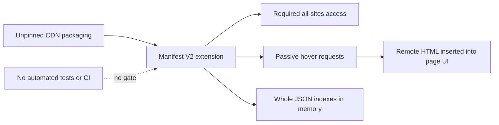
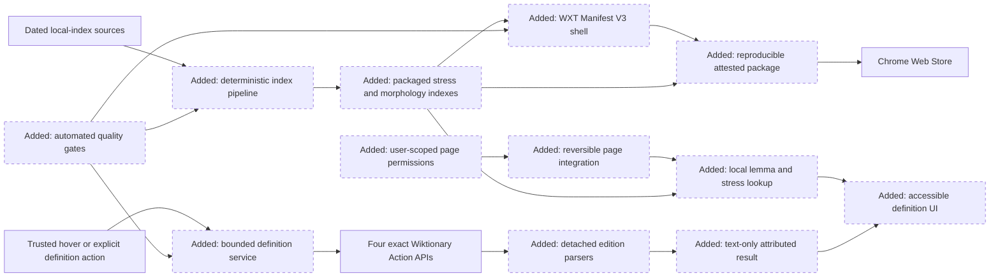
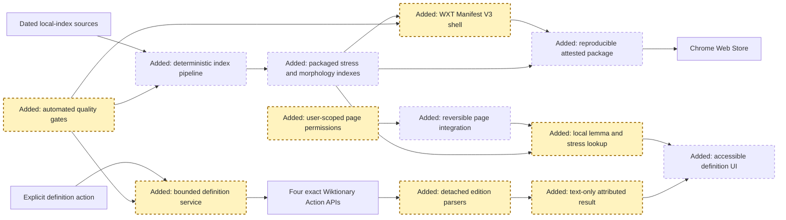
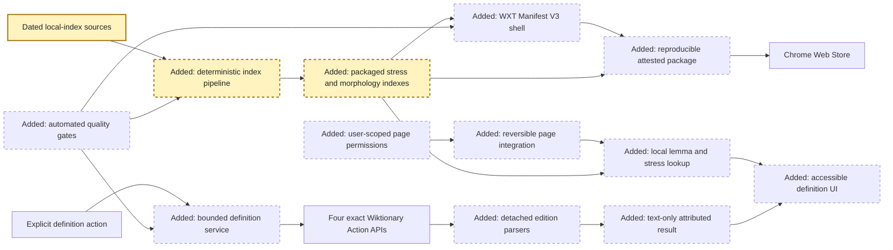
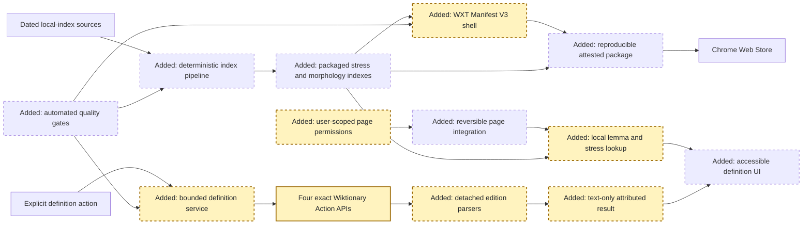
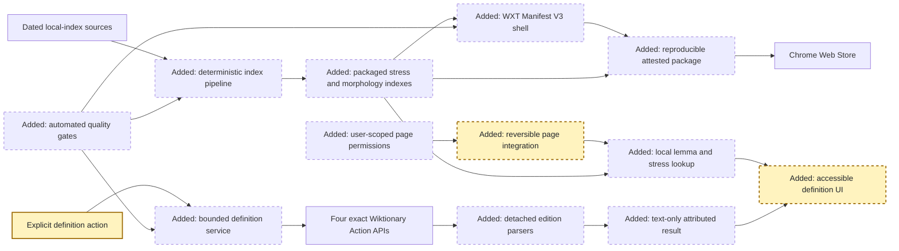
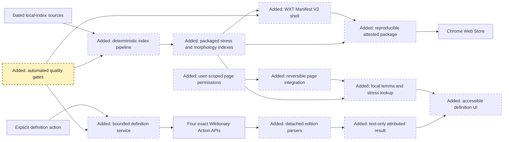
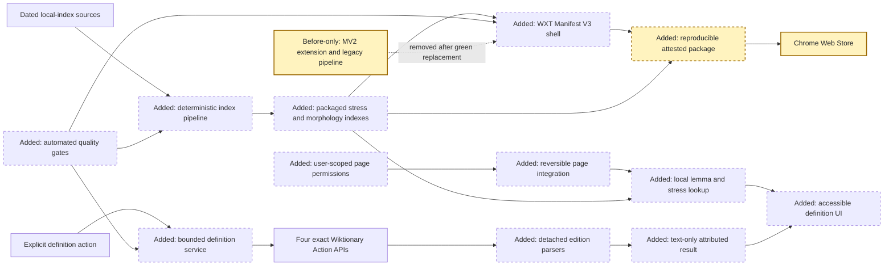

<!-- markdownlint-disable-file -->
# RPI Plan: Slava Russian Dictionary rearchitecture

## Task Metadata

* Task ID: `SLAVA-MV3-REARCH-001`
* Task slug: `slava-russian-dictionary-rearchitecture`
* Plan date: 2026-10-03

## Executive Summary

* Bottom line: Replace the removed Manifest V2 extension with a project-owned Manifest V3 extension that performs Russian word detection, stress marking, and morphology locally, then retrieves definitions from the selected live Wiktionary after a trusted 100 ms word hover or an explicit pointer, keyboard, or search action. English is the mandatory fallback when French, German, or Russian Wiktionary has no usable Russian-entry definition.
* Why this matters: The package no longer carries a large multilingual definition corpus or operates a Slava definition service. The trade-off is that definitions are online-only and Wikimedia receives the requested lemma, edition, IP address, and ordinary network metadata.
* Planning result: Complete and implementation-ready after standard critique. The seven phases define the extension shell, deterministic local indexes, bounded MediaWiki client and edition parsers, reversible page UI, automated verification, documentation, legacy removal, release provenance, and post-validation interaction refinements.
* Confidence and uncertainty: High for the architecture, API contract, permission boundary, local index direction, and test ownership. Moderate for long-term live parser stability and final Chromium performance; those are controlled by versioned fixtures, bounded live canaries, explicit failure states, and release budgets.

### What You May Not Know

* Chrome requires host permissions for cross-origin requests made by an extension service worker even though Wiktionary supports anonymous CORS. Slava therefore declares only the four exact HTTPS Wiktionary origins; it does not request a Wiktionary wildcard or all-HTTPS access.
* A single `action=parse` request can return parsed HTML, revision, resolved title, redirects, and table-of-contents anchors. Slava reduces that untrusted HTML to a typed text-only model in a detached parser and never inserts upstream markup into the extension or page.
* Representative live responses ranged from small missing-page errors to nearly 0.9 MB of JSON. Each request is therefore time-, size-, origin-, content-type-, and schema-bounded.
* The first release has no persistent Slava definition cache. Stress and morphology work offline; definitions fail visibly when Wikimedia is unavailable.
* German Wiktionary coverage is sparse in the measured source evidence. The UI must label English fallback rather than imply that an English result came from German Wiktionary.

## Phase Checklist

### Before



### After



The final system keeps annotation local, permits bounded definition requests after a trusted 100 ms hover or explicit action, allows only four fixed remote origins, converts remote responses to inert structured text, and treats the exact packaged ZIP as the tested release object.

<!-- rpi:phase id=P01 -->
### [x] P01: Establish foundations and contracts

Goals:
* Create the locked MV3 workspace and freeze the local-data, messaging, remote-definition, fixture, permission, and performance contracts that every later phase must satisfy.

Dependencies:
* Completed research and spikes S01-S02F.



Highlighted work: establish the shell and binding contracts for permissions, local indexes, remote requests, typed results, fixtures, and objective budgets.

<!-- rpi:task id=P01-T01 -->
#### [x] P01-T01: Create the locked WXT and TypeScript workspace

Goals:
* Produce a minimal reviewable MV3 development build with explicit browser targets, generated-manifest policy, dependency boundaries, and test entrypoints.

Requirements:
* FR-007; NFR-001, NFR-007, NFR-008, NFR-009, NFR-010.
* Use one committed JavaScript package lock, strict TypeScript, WXT, Vitest, and Playwright.
* Do not add React, another UI framework, jQuery, Bootstrap, Underscore, or a second extension framework.
* Generate Chrome MV3 output and a non-release-blocking Firefox-compatible build.
* Manifest policy tests must fail on undeclared permissions, wildcard remote hosts, remotely hosted executable code, or generated-manifest drift.

Details:
* Create minimal background, content, popup, and options entrypoints; keep domain modules independent of WXT entrypoint conventions.
* Use repository-compatible package registry metadata and the approved package tooling.
* Maximum additions for the first implementation are one package workspace, one WXT configuration, one TypeScript configuration family, one formatting/lint configuration family, and the entrypoint/domain/test roots named in the Artifact Ownership Map.

References:
* [.copilot-tracking/research/2026-10-03/slava-russian-dictionary-rearchitecture-research.md](../../research/2026-10-03/slava-russian-dictionary-rearchitecture-research.md): WXT and MV3 framework evidence.
* [chrome/manifest.json](../../../chrome/manifest.json): MV2 baseline to replace, not port.

Dependencies:
* None.

<!-- rpi:task id=P01-T02 -->
#### [x] P01-T02: Define local-data and runtime message contracts

Goals:
* Give the pipeline, service worker, content script, and UI one versioned type-safe vocabulary for local lookup, remote definitions, attribution, and bounded errors.

Requirements:
* FR-002, FR-003, FR-004, FR-005; NFR-002, NFR-003, NFR-004, NFR-007.
* Local lookup preserves all lemma and stress alternatives and never invents a resolution for a conflict.
* Content scripts may request a definition by normalized lemma and edition only after a browser-trusted user event; they may not supply a URL, headers, page URL, surrounding text, or arbitrary request options.
* Background handlers accept messages only from this extension and an authorized tab or extension page, reject duplicate/replayed request IDs, and allow at most one active definition request per tab.
* The following shapes are contracts:

```ts
type DefinitionEdition = "en" | "fr" | "de" | "ru";

interface DefinitionRequest {
  requestId: string;
  lemma: string;
  edition: DefinitionEdition;
}

interface DefinitionEntry {
  partOfSpeech: string | null;
  senses: string[];
}

interface DefinitionResult {
  requestId: string;
  requestedEdition: DefinitionEdition;
  resolvedEdition: DefinitionEdition;
  requestedLemma: string;
  resolvedTitle: string;
  revisionId: number;
  sourceUrl: string;
  entries: DefinitionEntry[];
  fallbackUsed: boolean;
  attribution: string;
}

type DefinitionErrorCode =
  | "offline"
  | "timeout"
  | "throttled"
  | "missing"
  | "no-russian-entry"
  | "response-too-large"
  | "unexpected-origin"
  | "invalid-content-type"
  | "invalid-response"
  | "api-changed"
  | "aborted";
```

* Runtime results contain text and allowlisted source metadata only; no upstream HTML node or string crosses the parser boundary.

Details:
* Version schemas separately for local index files, runtime messages, definition fixtures, and quality reports.
* Normalize Unicode and lemma length before messaging; reject empty, multi-line, control-character, or overlong terms before any remote call.
* Preserve edition-specific alternatives without claiming sense-level equivalence across editions.

Guidance:
* Reuse `WIKTIONARY_HOSTS` from `src/config/wiktionary-hosts.ts` as the single authoritative remote-host list in contracts, manifest policy, and the later MediaWiki client.

References:
* [.copilot-tracking/spikes/2026-10-03/slava-rearchitecture-spikes.md](../../spikes/2026-10-03/slava-rearchitecture-spikes.md): ambiguity, fallback, stress, and morphology findings.
* [chrome/content_script.js](../../../chrome/content_script.js): legacy arbitrary remote HTML boundary to replace.

Dependencies:
* P01-T01.

<!-- rpi:task id=P01-T03 -->
#### [x] P01-T03: Establish fixtures and verify Chromium network assumptions

Goals:
* Close the pending browser feasibility spike before full runtime work by proving exact permissions, service-worker fetch, CORS identification, response limits, and representative parser fixtures in Chromium.

Requirements:
* FR-004; NFR-001, NFR-003, NFR-004, NFR-005, NFR-008.
* The generated manifest contains exactly these definition hosts: `https://en.wiktionary.org/*`, `https://fr.wiktionary.org/*`, `https://de.wiktionary.org/*`, and `https://ru.wiktionary.org/*`.
* Service-worker GET requests use `origin=*`, `format=json`, `formatversion=2`, `action=parse`, `prop=text|tocdata|revid|displaytitle`, `redirects=1`, `disableeditsection=1`, `disablelimitreport=1`, and an identifying `Api-User-Agent`.
* One edition attempt has an 8-second timeout and a 2 MiB decoded-response ceiling. A non-English request may make one Action API GET to the selected edition and one Action API GET to English only; no automatic background retry is allowed. Browser-managed `OPTIONS` preflight is not an edition attempt.
* Fixture ownership includes at least: usable English/French/German/Russian pages, German missing page, multiple Russian homographs, redirect, malformed JSON, `errors[]`, hostile markup, oversized body, wrong origin, wrong content type, timeout, abort, and no usable Russian section.

Details:
* Capture bounded fixtures with source edition, title, revision, retrieval date, and license metadata. Keep live tests separate from deterministic fixture tests.
* Confirm that a content script cannot bypass the background request contract and that response parsing works after service-worker termination/restart.
* If the exact-host Chromium spike fails, stop implementation and revise the contract; do not widen permissions as a workaround.

Guidance:
* Use `normalizeLemma` from `src/domain/normalize-lemma.ts` and the versioned types under `src/contracts/`; deterministic fixture metadata is governed by `data/schema/definition-fixture.schema.json`.

References:
* [.copilot-tracking/research/2026-10-03/slava-russian-dictionary-rearchitecture-research.md](../../research/2026-10-03/slava-russian-dictionary-rearchitecture-research.md): W14-W20.
* [.copilot-tracking/spikes/2026-10-03/slava-rearchitecture-spikes.md](../../spikes/2026-10-03/slava-rearchitecture-spikes.md): S03 pending browser-loading evidence.

Dependencies:
* P01-T01.
* P01-T02.

<!-- rpi:phase id=P02 -->
### [x] P02: Build deterministic local indexes

Goals:
* Produce compact, attributable, deterministic stress and morphology artifacts that support offline page behavior without including definition corpora.

Dependencies:
* P01.



Highlighted work: turn pinned source snapshots into validated stress and morphology artifacts, reports, digests, and runtime metadata.

<!-- rpi:task id=P02-T01 -->
#### [x] P02-T01: Implement source acquisition and provenance

Goals:
* Make every local index build traceable to immutable inputs, reviewed field policy, locked tools, and explicit licensing.

Requirements:
* FR-007, FR-008; NFR-007, NFR-009.
* Pin source URL, revision or snapshot date, digest, extractor/tool revision, configuration digest, and license.
* Verify digests before parsing and fail closed on missing, mutable, mismatched, or unapproved sources.
* Build identically in local and GitHub Actions environments from the same lock and configuration.
* Do not acquire definitions for packaging.

Details:
* Use the reviewed MIT stress source as a baseline and the dated Kaikki/Wiktextract evidence needed for morphology and conflict reports.
* Emit one machine-readable provenance manifest consumed by later packaging and documentation.

Guidance:
* Reuse the bounded fixture-capture conventions in `tools/capture-mediawiki-fixtures.mjs`: verify expected metadata before parsing, enforce a byte ceiling, and persist source identity beside generated evidence.

References:
* [.copilot-tracking/spikes/2026-10-03/slava-rearchitecture-spikes.md](../../spikes/2026-10-03/slava-rearchitecture-spikes.md): source revisions and digests.
* [scripts/download-resources.py](../../../scripts/download-resources.py): unpinned legacy acquisition to replace.

Dependencies:
* P01-T02.

<!-- rpi:task id=P02-T02 -->
#### [x] P02-T02: Generate and validate the stress index

Goals:
* Package a sub-megabyte stress baseline with explicit ambiguity and conflict behavior rather than guessing unresolved stress.

Requirements:
* FR-002, FR-007; NFR-005, NFR-007, NFR-008.
* Generate deterministic bytes and digest from pinned input.
* Preserve multiple valid stresses; unresolved source conflicts return unchanged text plus diagnostic metadata rather than one guessed stress.
* Verify representative high-frequency, `ё/е`, capitalization, hyphenation, compound, homograph, missing, and conflict cases.
* Compressed stress artifact budget: at most 0.75 MiB.

Details:
* Reuse the FSA data format where license and runtime evidence permit; do not copy an unrelated application layer.
* Emit coverage, exact-match, conflict, missing, size, and digest reports.

Guidance:
* Consume verified files from `SLAVA_SOURCE_CACHE` using `data/config/index-sources.json` and include `data/generated/source-provenance.json` in generated evidence. Apply the normalization and conflict rules in `data/config/index-policy.json`.

References:
* [.copilot-tracking/spikes/2026-10-03/slava-rearchitecture-spikes.md](../../spikes/2026-10-03/slava-rearchitecture-spikes.md): S02D and S02E.

Dependencies:
* P02-T01.

<!-- rpi:task id=P02-T03 -->
#### [x] P02-T03: Generate and validate the morphology index

Goals:
* Package exact form-to-lemma relations and form-specific stress evidence from the same pinned Kaikki snapshot while preserving every ambiguity and exception.

Requirements:
* FR-003, FR-007; NFR-005, NFR-007, NFR-008.
* Filter non-Russian helper values and non-page-token surfaces using a documented deterministic policy.
* Reconstruct every accepted form-to-lemma relation exactly; semantic mismatch count must be zero against the canonical intermediate representation.
* Preserve one-to-many lemma candidates and explicit irregular/singleton exceptions.
* Treat lexical aspect partners as related verb metadata, not as inflected forms owned by each other's paradigms.
* Preserve accented canonical spellings from form-of entries as exact stress evidence even though those entries do not contribute reverse morphology relations.
* Preserve explicit alternative-spelling targets as additional lemma candidates for the alternative surface without reversing the relationship.
* Audit every Kaikki record's form tags, form sources, sense relationship fields, and grammatical metadata before finalizing the generic classification rules; record counts and representative examples for every retained or excluded class.
* Exclude unsourced derivational and lexical-relative forms from inflection ownership while retaining canonical forms, sourced inflections, grammatical variants, and explicit alternative spellings.
* Do not treat shared full-table pronoun rows as forms owned by every pronoun headword. Use explicit inflectional `form_of` relationships to recover pronoun and other missing form-to-lemma mappings.
* Follow lexical alternative spellings, but do not expand abbreviation, acronym, initialism, letter, morpheme, clipping, or ellipsis senses into every referenced full-form page.
* Treat combining grave accents as non-lexical stress notation during index normalization, while preserving diaeresis so `ё` remains distinct.
* Retain accented canonical and inflected forms as a compact fallback only when the dedicated stress FSA has no entry; multiple Kaikki patterns retain an ambiguous diagnostic and render their union, matching legacy behavior.
* Compressed morphology artifact budget: at most 15 MiB; any increase above the 13.2 MiB spike result requires a documented corpus-delta explanation.

Details:
* Emit counts for source, eligible, emitted, filtered, rejected, ambiguous, paradigms, exceptions, supplemental stress coverage, bytes, and digest.
* Test determinism by producing byte-identical output in two isolated builds.

Guidance:
* Reuse the browser-neutral `StressFsa` implementation in `src/indexes/stress-fsa.ts`; verify the per-file digests in `public/indexes/stress/metadata.json` before publishing runtime state, and treat keys in `conflicts.json` as unresolved.
* Preserve stress per exact surface form rather than propagating lemma stress across a paradigm because Russian stress can shift between inflections.

References:
* [.copilot-tracking/spikes/2026-10-03/slava-rearchitecture-spikes.md](../../spikes/2026-10-03/slava-rearchitecture-spikes.md): S02F.
* [.copilot-tracking/spikes/2026-10-03/tools/run_morphology_index_spike.py](../../spikes/2026-10-03/tools/run_morphology_index_spike.py): exact hybrid prototype.

Dependencies:
* P02-T01.

<!-- rpi:phase id=P03 -->
### [x] P03: Implement MV3 orchestration and lookup services

Goals:
* Provide persistent settings, user-scoped permissions, local lookup, and a bounded live-definition service that survives MV3 service-worker restarts.

Dependencies:
* P01.
* P02 runtime artifacts.



Highlighted work: implement typed background services for state, local indexes, and exact-origin MediaWiki access.

<!-- rpi:task id=P03-T01 -->
#### [x] P03-T01: Implement settings and page-permission lifecycle

Goals:
* Let users activate Slava temporarily or persistently on selected sites and revoke access without relying on service-worker memory.

Requirements:
* FR-001, FR-005, FR-006; NFR-001, NFR-002, NFR-004.
* Temporary activation uses `activeTab`; persistent site access is optional, origin-scoped, user-initiated, listed, and revocable.
* Definition host permissions remain the four fixed origins and are not reused as page-content permissions.
* Settings persist selected definition edition, activation mode, accessibility preferences, and diagnostics state in versioned storage.
* Listener registration occurs synchronously at worker startup; state is reconstructed after worker termination.

Details:
* Separate page-permission UI from definition-provider disclosure so users understand the two access classes.
* Removal of a persistent origin must unregister or disable Slava on that origin without affecting unrelated sites.

Guidance:
* The synchronous worker listener and storage reconstruction boundary live in `src/background/settings-service.ts`. Reuse `normalizePageOrigin` and the permission helpers under `src/settings/`; do not merge optional page origins with fixed Wiktionary origins.

References:
* [chrome/background.js](../../../chrome/background.js): volatile legacy state to replace.
* [chrome/options.js](../../../chrome/options.js): legacy settings behavior.

Dependencies:
* P01-T01.
* P01-T02.

<!-- rpi:task id=P03-T02 -->
#### [x] P03-T02: Implement local morphology and stress lookup

Goals:
* Resolve page tokens to all supported lemma and stress candidates quickly from packaged immutable assets.

Requirements:
* FR-002, FR-003; NFR-004, NFR-005, NFR-008.
* Cold lookup p95 is at most 150 ms and warm lookup p95 is at most 50 ms in the Chromium benchmark corpus.
* Load only the index regions needed for a lookup; do not materialize the full projected installed representation in every tab.
* Cache behavior is bounded and observable through public service behavior; cache correctness does not depend on service-worker lifetime.
* Ambiguous candidates remain ordered by documented deterministic evidence, with no false certainty.
* Verb lemma candidates expose their grammatical aspect and linked counterpart when the pinned source supplies that relationship.
* Combine valid exact-form stress positions across the dedicated and supplemental sources; when they differ, retain an ambiguous diagnostic and render their union.
* Exact pages remain candidates while explicit canonical alternative targets are added, so an alternative spelling can show both its form note and the canonical definition.

Details:
* Keep lookup domain APIs browser-neutral and test them independently of WXT.
* Use packaged asset URLs and immutable digests; reject schema/digest mismatch before publishing usable state.

Guidance:
* Reuse `MorphologyIndex` and `StringPostingsTable` from `src/indexes/morphology-index.ts`. Runtime loading must preserve the file boundaries and per-file digests declared in `public/indexes/morphology/metadata.json`.
* The atomic verified loader is `LocalLookupService` in `src/background/local-lookup-service.ts`. It retains searchable directories but reads and verifies postings and lemma chunks lazily through `VerifiedAssetReader`; preserve its bounded 512-result cache and diagnostics contract.

References:
* [.copilot-tracking/spikes/2026-10-03/slava-rearchitecture-spikes.md](../../spikes/2026-10-03/slava-rearchitecture-spikes.md): selected stress and morphology representations.

Dependencies:
* P02-T02.
* P02-T03.
* P03-T01.

<!-- rpi:task id=P03-T03 -->
#### [x] P03-T03: Implement the MediaWiki client and edition parsers

Goals:
* Return safe attributed definitions from English, French, German, and Russian Wiktionary within the fixed request and fallback contract.

Requirements:
* FR-004; NFR-002, NFR-003, NFR-004, NFR-008.
* Build endpoints internally from an edition enum and normalized lemma; reject any arbitrary URL or final origin.
* Send no cookies or credentials, use GET, identify the client with `Api-User-Agent`, and serialize requests per trusted user action. When Chromium emits `OPTIONS` preflight, it targets the same exact allowlisted request URL and therefore may repeat the normalized lemma in the query string; it must contain no additional page context, body, cookies, or credentials.
* Enforce 8-second timeout, 2 MiB decoded ceiling, JSON/content-type contract, exact final origin, and typed MediaWiki `error` or `errors[]` handling.
* A non-English lookup makes the selected-edition attempt first and one English attempt only when the selected edition returns `missing` or `no-russian-entry`. English never falls back to another edition.
* Parse in a detached document using separate edition modules. Extract only Russian-language definition senses and POS labels; remove examples, media, styles, scripts, forms, navigation, unrelated languages, and arbitrary links unless a later requirement explicitly allows a safe field.
* Return source page URL, edition, resolved title, revision, attribution, and `fallbackUsed`.
* No persistent response cache, automatic retry, prefetch, arbitrary background fetch, or request after the active hover/popup is dismissed in the first release.

Details:
* Treat parser failure as `api-changed`, not as “no definition,” when a page contains a plausible Russian section but violates the expected fixture contract.
* Honor server throttling by surfacing a retry time or disabled state; do not silently loop.
* Keep live canary probes out of deterministic PR and release builds.

References:
* [.copilot-tracking/research/2026-10-03/slava-russian-dictionary-rearchitecture-research.md](../../research/2026-10-03/slava-russian-dictionary-rearchitecture-research.md): `Use one bounded Action API request per edition attempt`.
* [conf/config.json](../../../conf/config.json): legacy edition heading evidence; German is newly required.
* [chrome/content_script.js](../../../chrome/content_script.js): legacy parser behavior and unsafe rendering boundary.

Dependencies:
* P01-T02.
* P01-T03.
* P03-T01.

<!-- rpi:phase id=P04 -->
### [x] P04: Integrate pages and accessible definition UI

Goals:
* Add reversible stress annotation and an explicit keyboard- and pointer-accessible definition workflow without damaging host-page behavior.

Dependencies:
* P03.



Highlighted work: annotate eligible text reversibly and expose explicit definition actions and truthful network/error states.

<!-- rpi:task id=P04-T01 -->
#### [x] P04-T01: Implement reversible page text integration

Goals:
* Mark stress on supported Russian text while preserving page state, editability, navigation, and cleanup.

Requirements:
* FR-001, FR-002, FR-006; NFR-004, NFR-005, NFR-006.
* Process text nodes incrementally; never replace `body.innerHTML`, clone whole subtrees, or alter script/style/editor inputs.
* Exclude editable controls, code/preformatted content, extension UI, hidden/inert content, and unsupported browser surfaces.
* Mutation handling is bounded, deduplicated, and disconnectable.
* Deactivation restores original text and removes observers, event handlers, UI roots, and extension attributes without reload.
* First-release support matrix covers ordinary top-level HTML documents and same-origin frames only when permission and tests cover them; browser-internal pages, PDF viewer, Google Docs canvas, cross-origin frames, and closed shadow roots are unsupported.

Details:
* Prefer minimal text-node splitting or reversible wrappers with ownership markers.
* Preserve selection where practical and never make every token focusable.

Guidance:
* Extend the WXT unlisted script at `entrypoints/page-integration.ts`; it exists specifically so `activeTab` injection does not add `<all_urls>` to required host permissions.

References:
* [chrome/content_script.js](../../../chrome/content_script.js): whole-page legacy implementation to replace.

Dependencies:
* P03-T02.
* P03-T01.

<!-- rpi:task id=P04-T02 -->
#### [x] P04-T02: Implement trusted hover and explicit definition interaction

Goals:
* Let pointer users inspect definitions by dwelling on an annotated word and let pointer, keyboard, and search users explicitly request the same bounded result with clear source, fallback, loading, offline, throttled, unavailable, and parser-change states.

Requirements:
* FR-003, FR-004, FR-006; NFR-002, NFR-003, NFR-006.
* A trusted pointer hover that remains on an annotated word for at least 100 ms may start bounded definition requests. Pointer exit before the delay cancels the request; leaving both the word and hover card closes it and aborts in-flight work. Explicit trusted pointer/keyboard actions and direct extension-page search remain supported; script-generated page events are ignored.
* Each interaction creates one single-use request ID. Duplicate/replayed messages and concurrent requests for the same tab are rejected or replace-and-abort the previous request according to the typed contract.
* Keyboard lookup uses one bounded non-editable selection or typed-search fallback; annotated tokens do not enter tab order.
* The hover card uses Shadow DOM or equivalent isolation, remains anchored without stealing focus, and shows the exact hovered surface form plus every valid lemma result. The explicit dialog uses semantic headings/lists, labelled controls, focus management, Escape dismissal, focus return, 200% zoom, reduced motion, and contrast-compliant styling.
* For verb candidates with local aspect metadata, show the aspect and linked counterpart once without treating the counterpart as another definition candidate for the same surface form.
* Show requested edition, resolved edition, labelled English fallback, source title, revision/source link, and attribution.
* Closing or replacing the popup aborts in-flight work and prevents late results from attaching to stale UI.

Details:
* Render all valid ambiguity-preserving lemma results; do not silently select one homograph.
* Source links open the exact HTTPS Wiktionary page in a normal browser tab and are not fetched through an arbitrary-URL background API.

Guidance:
* Send definition requests through the typed `DefinitionService` in `src/background/definition-service.ts`. It requires a tab sender, rejects replay and concurrent request IDs, and aborts the matching request on `definition.cancel`.
* Reuse the bounded `MediaWikiClient` in `src/definitions/mediawiki-client.ts` and its text-only offscreen parser boundary in `src/definitions/offscreen-parser.ts`; page code must never receive or render raw Wiktionary HTML.
* Extend `PageAnnotator` in `src/page/page-annotator.ts` and the idempotent WXT entrypoint in `entrypoints/page-integration.ts`. Stress wrappers use `data-slava-token`, remain outside tab order, and are removed through the existing `page.deactivate` control path.

References:
* [.copilot-tracking/research/2026-10-03/slava-russian-dictionary-rearchitecture-research.md](../../research/2026-10-03/slava-russian-dictionary-rearchitecture-research.md): live-definition privacy and parser contract.

Dependencies:
* P03-T03.
* P04-T01.

<!-- rpi:task id=P04-T03 -->
#### [x] P04-T03: Implement settings, permissions, and local diagnostics UI

Goals:
* Make the extension's access, edition choice, local data version, network behavior, and known limitations inspectable and controllable without telemetry.

Requirements:
* FR-001, FR-005, FR-006, FR-008; NFR-001, NFR-002, NFR-006.
* Users can choose `en`, `fr`, `de`, or `ru`, inspect and revoke persistent site access, disable current-tab processing, and see that English fallback is mandatory.
* Show local index versions/digests, package version, selected edition, exact Wiktionary hosts, last local integrity result, and last bounded definition error without page content or full lookup-history logging.
* Diagnostic export is explicit, local, bounded, sanitized, and excludes page URLs, surrounding text, browsing history, IP address, and raw definition HTML.

Details:
* Explain that stress/morphology are offline and definitions are online.
* Do not add accounts, sync, analytics, crash reporting, or remote diagnostics.

Guidance:
* Page deactivation is already implemented by the `page.deactivate` content-script control path in `entrypoints/page-integration.ts`; settings UI should send that message to the active tab rather than duplicating cleanup logic.
* The local batch and definition services expose only bounded diagnostics. Continue to keep raw page URLs, surrounding text, raw Wiktionary HTML, and lookup history out of storage.

References:
* [chrome/options.html](../../../chrome/options.html): legacy settings surface to replace.
* [README.md](../../../README.md): current user guidance to update in P06.

Dependencies:
* P03-T01.
* P03-T02.
* P03-T03.

<!-- rpi:phase id=P05 -->
### [x] P05: Automate correctness, security, privacy, accessibility, and performance gates

Goals:
* Make deterministic tests own domain behavior and fixtures, while Chromium tests own lifecycle, page integration, permissions, requests, privacy, and exact-package behavior.

Dependencies:
* P02-P04.



Highlighted work: enforce the complete semantic, browser, network, privacy, accessibility, performance, and packaging contract before release.

<!-- rpi:task id=P05-T01 -->
#### [x] P05-T01: Implement domain, parser, property, and data tests

Goals:
* Prove deterministic local semantics and remote-response reduction without network dependence.

Requirements:
* FR-002, FR-003, FR-004, FR-007; NFR-003, NFR-007, NFR-008.
* Unit tests own Unicode normalization, token filtering, stress placement, morphology reconstruction, ambiguity, fallback decision, response validation, edition parsing, attribution, and error mapping.
* Property/fuzz tests cover arbitrary Unicode, combining marks, controls, excessive length/depth/counts, malformed records, and hostile HTML.
* Fixture tests must assert that scripts, styles, media, event attributes, forms, unrelated languages, and unsupported links never enter `DefinitionResult`.
* Data tests enforce determinism, zero morphology semantic mismatches, approved stress conflict behavior, source provenance, count balance, size budgets, and digest stability.
* Regression tests preserve externally observable legacy behavior only where the plan explicitly retains it; they do not preserve unsafe HTML insertion, passive requests, broad permissions, or whole-page mutation.
* Regression coverage proves that aspect partners do not become reverse morphology owners and that aspect metadata survives deterministic index reconstruction.
* Regression coverage proves that `году` retains both documented stress positions and renders `го́ду́` without claiming one context-free pronunciation.
* Regression coverage proves that `сел` retains its exact page, resolves the verb lemma `сесть`, and also resolves the explicit noun alternative target `сёл`.

Details:
* Use a fake monotonic clock for timeout, abort, throttling, and cache-related behavior; do not sleep in deterministic tests.
* Keep live upstream content out of required PR tests.

References:
* [.copilot-tracking/spikes/2026-10-03/slava-rearchitecture-spikes.md](../../spikes/2026-10-03/slava-rearchitecture-spikes.md): golden and adversarial cases.

Dependencies:
* P02.
* P03-T02.
* P03-T03.

<!-- rpi:task id=P05-T02 -->
#### [x] P05-T02: Implement Chromium lifecycle, network, privacy, and accessibility tests

Goals:
* Prove that the real MV3 extension behaves correctly across service-worker restarts, permissions, dynamic pages, explicit lookups, failure states, and assistive interaction.

Requirements:
* FR-001-FR-006; NFR-001-NFR-006, NFR-008, NFR-010.
* Test temporary activation, persistent grant/denial/revocation, service-worker termination, SPA mutations, deactivation restoration, popup replacement, request abort, offline mode, throttling, timeout, oversized response, wrong origin, malformed API response, parser drift, and English fallback.
* Network interception must fail the test if any Action API GET occurs before a trusted 100 ms hover or explicit action, targets a non-allowlisted origin, exceeds one selected-edition GET plus one English fallback GET per distinct lemma candidate, or includes page URL, surrounding text, browsing history, unrelated tokens, cookies, or credentials.
* Dispatch synthetic pointer/keyboard events, pointer exits before the hover delay, and replay/duplicate runtime messages; assert zero additional Action API GETs. Inspect browser-managed `OPTIONS` separately and require the same allowlisted request URL, no body, and no page context, cookies, or credentials beyond the normalized lemma already present in that URL.
* Accessibility coverage includes keyboard-only lookup, screen-reader names/roles, focus containment and return, Escape, zoom, contrast, reduced motion, and non-editable selection behavior.
* Browser coverage proves that `разбухать` renders one definition entry labelled imperfective with `разбухнуть` as its perfective counterpart.
* Browser tests run against both unpacked development output and the exact packaged ZIP smoke fixture.

Details:
* Use local deterministic HTTP fixtures for failure and hostile-response cases; use bounded live smoke tests only in a scheduled non-release-blocking workflow.
* Record request metadata without recording sensitive page content.

References:
* [.copilot-tracking/research/2026-10-03/slava-russian-dictionary-rearchitecture-research.md](../../research/2026-10-03/slava-russian-dictionary-rearchitecture-research.md): Chrome and MediaWiki network requirements.

Dependencies:
* P04.
* P05-T01.

<!-- rpi:task id=P05-T03 -->
#### [x] P05-T03: Enforce CI, performance, package, and supply-chain gates

Goals:
* Block releases that exceed budgets, widen permissions, introduce remote code, lose provenance, or package undeclared files.

Requirements:
* FR-007, FR-008; NFR-005, NFR-007, NFR-008, NFR-009.
* Pull requests run formatting, lint, strict type-check, unit/property tests, data fixture tests, Chromium tests, dependency review, CodeQL, license policy, manifest diff, package allowlist, and compiled-output scans.
* Release ZIP budget: at most 20 MiB compressed. Installed-size budget: at most 80 MiB. Local data budgets remain P02's 0.75 MiB stress and 15 MiB morphology limits.
* Representative activation on a 100,000-character ordinary HTML fixture completes within 500 ms p95 and adds at most 64 MiB peak extension-process heap over baseline; lookup budgets remain P03-T02.
* The package contains no test fixtures, raw snapshots, pipeline tools, source maps with proprietary paths, legacy code, remote executable URLs, undeclared wildcard hosts, or undeclared artifacts. Required definition-provider hosts remain exact; the declared optional `http://*/*` and `https://*/*` page-access patterns remain necessary for user-chosen persistent site activation.
* CI uses pinned actions and least-privilege permissions; privileged release jobs cannot run untrusted pull-request code.

Details:
* If initial measured code overhead makes a threshold infeasible, implementation stops at that gate for plan revision rather than silently weakening it.
* Report compressed ZIP, installed bytes, per-artifact bytes, activation/lookup latency, and memory trend on every release candidate.

References:
* [scripts/package-extension.sh](../../../scripts/package-extension.sh): unpinned legacy packaging path to replace.

Dependencies:
* P05-T01.
* P05-T02.

<!-- rpi:phase id=P06 -->
### [x] P06: Document, remove legacy paths, and produce the release artifact

Goals:
* Publish truthful policies and support material, remove every superseded implementation path, and make one reproducibly built, tested, attributed, and attested ZIP the submission candidate.

Dependencies:
* P01-P05.



Highlighted work: synchronize user-facing guarantees, remove the MV2 and live-HTML legacy paths, and attest the exact final ZIP.

<!-- rpi:task id=P06-T01 -->
#### [x] P06-T01: Finalize privacy, security, attribution, support, and recovery documentation

Goals:
* Let users, reviewers, and contributors understand exactly what is local, what is sent to Wikimedia, which permissions are used, and what the product does not guarantee.

Requirements:
* FR-005, FR-008; NFR-001-NFR-004, NFR-006, NFR-009, NFR-010.
* Update README and user docs for activation, permissions, supported surfaces, local stress/morphology, online definitions, edition choice, English fallback, diagnostics, limitations, smoke testing, and uninstall/revocation.
* Add privacy policy, security policy/reporting route, code license, local-data license/attribution, live Wiktionary attribution, third-party notices, build instructions, support matrix, parser-change response, rollback runbook, and Chrome Web Store disclosure text.
* State that Wikimedia receives each locally resolved lemma requested by a trusted hover or explicit lookup, the selected edition, IP address, and ordinary network metadata; Slava does not send page URL, surrounding text, browsing history, cookies, credentials, analytics, or telemetry.
* Do not claim anonymity, guaranteed API availability, fully offline definitions, perfect correctness, or absolute security.

Details:
* Document exact four Wiktionary hosts and why each is required.
* Recovery for a bad local index uses a new extension version built from an accepted prior source snapshot. Live parser breakage uses a code update; there is no Slava-hosted parser or remote kill switch.

References:
* [README.md](../../../README.md): current documentation to replace.
* [docs/index.md](../../../docs/index.md): current user guide.
* [.copilot-tracking/research/2026-10-03/slava-russian-dictionary-rearchitecture-research.md](../../research/2026-10-03/slava-russian-dictionary-rearchitecture-research.md): enforceable privacy and security properties.

Dependencies:
* P04.
* P05-T02.
* P02.

<!-- rpi:task id=P06-T02 -->
#### [x] P06-T02: Remove the legacy implementation and prove a clean source state

Goals:
* Leave one maintained source tree, one data pipeline, and one package path before producing the release candidate.

Requirements:
* FR-007, FR-008; NFR-007, NFR-009.
* Remove or replace every path in the Legacy Path Disposition table after replacement tests and documentation are green.
* No compiled output or package may contain MV2 manifests, jQuery, Bootstrap, Underscore, legacy page parsers, live HTML insertion, passive remote lookup, obsolete scripts, stale assets, remote executable URLs, or unused permissions.
* A clean checkout produces only declared generated roots and passes the full CI-equivalent suite.

Details:
* Update `.gitignore` for WXT, test, data-build, benchmark, and release output.
* Retain historical tracking artifacts; do not package them.

References:
* [chrome](../../../chrome): legacy extension root.
* [scripts](../../../scripts): legacy acquisition, parsing, indexing, and packaging root.
* [conf/config.json](../../../conf/config.json): legacy source/parser configuration.

Dependencies:
* P06-T01.
* P05.

<!-- rpi:task id=P06-T03 -->
#### [x] P06-T03: Reproduce, attest, and smoke-test the exact release ZIP

Goals:
* Make one immutable ZIP from the final clean revision the reproducibly built, tested, attributed, and submission-ready artifact.

Requirements:
* FR-007, FR-008; NFR-005, NFR-007, NFR-008, NFR-009.
* Perform two isolated clean builds with deterministic archive timestamp, path order, permissions, compression settings, and metadata; compare local-data bytes and final ZIP digest.
* Run manifest policy, remote-code scan, malware/code scanning, SBOM, provenance attestation, checksums, license verification, size/performance report, and packaged Chromium smoke tests against the submitted ZIP.
* Retain the exact ZIP, source revision, local-source digests, reproducibility result, SBOM, attestation verification, license inventory, quality report, size/performance report, live-canary report, and release notes.
* Chrome Web Store publication is a separate explicitly approved external action and is not executed by this plan.

Details:
* Generate Firefox-compatible output for portability evidence, but do not block the Chrome release on Firefox store signing.
* A scheduled live canary may report parser drift for the four editions; its live content does not become release input and a transient upstream outage does not invalidate a reproducible build.

References:
* [.copilot-tracking/research/2026-10-03/slava-russian-dictionary-rearchitecture-research.md](../../research/2026-10-03/slava-russian-dictionary-rearchitecture-research.md): provenance and live-API boundaries.

Dependencies:
* P06-T02.
* P05-T03.

<!-- rpi:phase id=P07 -->
### [x] P07: Refine toolbar and interaction behavior

Goals:
* Apply the post-validation interaction corrections without broadening permissions or weakening deterministic release guarantees.

Dependencies:
* P06.

<!-- rpi:task id=P07-T01 -->
#### [x] P07-T01: Use a face-only toolbar icon

Goals:
* Keep the full owl for extension identity while ensuring every density-specific toolbar asset shows only the owl face.

Requirements:
* Provide dedicated 16, 32, and 48 pixel toolbar assets.
* Keep the extension and store identity icons unchanged.
* Include every toolbar asset in the release allowlist and manifest-policy tests.

Dependencies:
* P01-T01.

<!-- rpi:task id=P07-T02 -->
#### [x] P07-T02: Bound parallel definition candidates and omit pure inflection pages

Goals:
* Reduce multi-candidate lookup latency and show only definition-bearing lexical entries.

Requirements:
* Permit at most two active definition requests per tab and cancel them independently.
* Process candidates in deterministic ranked order despite concurrent retrieval.
* Exclude Kaikki records identified as pure grammatical form pages from lemma candidates while retaining their exact-form stress and grammatical-analysis evidence.
* Preserve genuine homographs, lexical alternative spellings, and all grammatical ambiguity on the displayed lexical lemma.

Dependencies:
* P02-T03.
* P03-T02.
* P03-T03.
* P04-T02.

<!-- rpi:task id=P07-T03 -->
#### [x] P07-T03: Position combining stress marks independently of page typography

Goals:
* Keep combining acute accents visually attached to their Cyrillic base character when host pages apply letter spacing.

Requirements:
* Preserve copyable base-plus-combining-mark text.
* Render the visible acute accent independently of host font shaping and tracking while retaining the original combining mark in selectable text.
* Verify visual centering geometrically on a fixture with non-zero host-page letter spacing and hostile font styling; checking CSS declarations alone is insufficient.
* Preserve Kaikki exact-form stress as corroborating evidence for baseline conflict keys, including when it matches the dedicated FSA pattern; otherwise words such as `нефтепродукты` remain falsely unstressed.
* Encode `ё` positions separately from ordinary acute accents so pages that spell `ё` as `е` can render canonical forms such as `твёрдого` without changing capitalization.
* Preserve the source token's capitalization across case-insensitive lookup and caching.
* Keep the one-vowel suppression rule so particles such as `бы` are not marked.
* Suppress hover and pointer lookup while a primary-pointer text-selection drag is active so the popup cannot intercept the gesture or leave selection latched.

Dependencies:
* P04-T01.

<!-- rpi:task id=P07-T04 -->
#### [x] P07-T04: Preserve temporary activation across same-origin navigation

Goals:
* Keep “Enable on this tab” active after same-site navigation without requesting broad host access.

Requirements:
* Store temporary tab activation in session-scoped extension storage.
* Reinject only after completed same-origin navigation.
* Clear activation on cross-origin navigation, explicit disable, persistent-site activation, and tab closure.

Dependencies:
* P03-T01.
* P04-T01.

<!-- rpi:task id=P07-T05 -->
#### [x] P07-T05: Separate stress-mark and definition-popup preferences

Goals:
* Let users independently enable local stress annotation and online definition interaction.

Requirements:
* Default both preferences to enabled when reading older settings.
* Stress off and definitions on must preserve original spelling while retaining interactive known-word wrappers.
* Stress on and definitions off must annotate without installing definition listeners.
* Both off must leave page text unwrapped.
* Persist and export both preferences through the existing serialized settings path.

Dependencies:
* P04-T01.
* P04-T02.
* P04-T03.

<!-- rpi:task id=P07-T06 -->
#### [x] P07-T06: Revalidate and package the refinements

Goals:
* Produce complete release evidence for the refined behavior and regenerated lexical-only morphology index.

Requirements:
* Pass formatting, strict type-check, lint, complete unit/data/policy tests, deterministic Chromium tests, Firefox build, packaged smoke, SBOM, package verification, release quality gates, provenance, reproducibility, and high-severity dependency audit.
* Record final package size, installed size, digest, activation performance, and morphology digest.

Dependencies:
* P07-T01.
* P07-T02.
* P07-T03.
* P07-T04.
* P07-T05.

## User Decisions and Requirements

### Confirmed User Direction

* Rearchitect from the ground up rather than porting the dirty-coded Manifest V2 implementation.
* Reuse maintained patterns and tooling where useful, but do not inherit a large language-specific product codebase.
* Use WXT as build-time scaffolding while keeping domain code independent of framework conventions.
* Bundle stress and morphology data in every release; do not bundle or download definition corpora.
* Retrieve English, French, German, and Russian definitions directly from the corresponding live Wiktionary MediaWiki API only after explicit lookup.
* Use English as the mandatory fallback when a non-English edition has no usable Russian-entry definition.
* Use cloud CI for deterministic local indexing, full automated testing, packaging, and release evidence; do not operate a Slava definition service or CDN.
* Reduce extension size and make security and privacy guarantees testable and truthful.
* Restore Chrome first while preserving portable WebExtension domain boundaries.

### Planning Decisions and Feedback

| Group | Decision or feedback item | Status | Owner | Rationale or input needed | Evidence | Planning impact |
|-------|---------------------------|--------|-------|---------------------------|----------|-----------------|
| D1 | Project-owned TypeScript/WXT implementation with selective pattern reuse | Confirmed | User/evidence | Avoid Japanese-specific GPL product forks while retaining mature patterns | Research W4, W5, W9, W12 | P01-P06 |
| D2 | Bundle all definitions | Superseded by D7 | User | Size review led to direct live definitions | D7 | Definition corpora removed from P02 and package |
| D3 | Chrome first with portable domain boundaries | Confirmed | User/evidence | Restore the removed product without Chrome-only core logic | Research W9, W10 | P01, P05, P06 |
| D4 | Use measured compact local stress and morphology indexes | Confirmed | User/evidence | S02E/S02F materially reduce local data while preserving tested semantics | Spikes | P02, P03 |
| D5 | Support definition editions `en`, `fr`, `de`, and `ru` | Confirmed | User | Preserve multilingual definitions | User direction | P01, P03-P06 |
| D6 | Target edition first, English fallback second | Confirmed | User | Prefer requested language while retaining useful coverage | User direction and fallback spike | P03-T03, P04-T02, P05 |
| D7 | Live MediaWiki definitions with no Slava-hosted definition data | Confirmed | User | Avoid permanent definition storage and Slava hosting | User answer during implementation handoff | Plan-wide |
| D8 | Use one whole-page Action API GET per edition attempt | Confirmed | Evidence | One GET supplies all parser context; section requests add a round trip and remain large. Browser-managed `OPTIONS` preflight is not an edition attempt and is tested separately | Research W14, W16, W19, W20; critique PC-011 | P01-T03, P03-T03, P05-T02 |
| D9 | Declare four exact static Wiktionary host permissions | Confirmed | Platform constraint/evidence | Chrome requires service-worker host permissions; core definition behavior should not depend on a second permission prompt | Research W17 | P01-T03, P03-T03, P06-T01 |
| D10 | No persistent definition cache in the first release | Confirmed | User direction/planner | YAGNI; avoids stale-content, deletion, migration, and storage semantics | D7 and research W15 | P03-T03, P04, P06 |
| D11 | Standard independent critique | Confirmed | Default | User did not request deep critique or skip | RPI plan protocol | Critique Disposition |
| D12 | Restore original owl icons and main-branch hover definitions | Confirmed | User direction/manual validation | The user expects the original product identity and a popup showing the exact hovered form with all valid definitions after a short hover | User manual test feedback on 2026-10-03 and legacy `chrome/content_script.js` | P01-T01, P03-T03, P04-T02, P05-T02, P05-T03, P06-T01, P06-T03 |
| D13 | Retain Kaikki stress as an exact-form fallback | Confirmed | Implementation evidence | The pinned Kaikki snapshot contains current accented forms that are absent from the compact dedicated stress dictionary; discarding those accents creates avoidable coverage gaps | `иноаге́нтов` in the pinned Kaikki source and missing from `StressFsa` | P02-T03, P03-T02, P05-T01, P06-T03 |
| D14 | Encode morphology string pools as Windows-1251 with UTF-8 fallback | Confirmed | User direction/implementation evidence | Standard single-byte Cyrillic encoding reduces unpacked storage while per-string UTF-8 fallback preserves historical letters outside Windows-1251 without a proprietary alphabet | User size review on 2026-10-03, current UTF-8 string-pool measurements, and full-corpus `ѳ` evidence | P02-T03, P03-T02, P05-T01, P05-T03, P06-T03 |
| D15 | Match the compact main-branch definition card | Confirmed | User direction/manual validation | Reader-facing cards should prioritize the exact word and definitions, with provenance moved out of the primary reading surface | User manual feedback on 2026-10-03 and legacy `chrome/content_script.js` | P04-T02, P05-T02, P06-T01 |
| D16 | Restore legacy stress rendering conventions | Confirmed | User direction/manual validation | Ambiguous forms display every valid stress position, while one-vowel words suppress redundant acute accents | User feedback on `полок` and `как` plus legacy `chrome/content_script.js` | P02-T03, P03-T02, P04-T01, P05-T01, P05-T02, P06-T03 |
| D17 | Rank definition candidates by proximity to the surface form | Superseded by D33 | User direction/manual validation | Exact inflected-form entries were initially retained before broader lemma entries | User feedback on `читают` | P04-T02, P05-T02 |
| D18 | Model verb aspect partners separately from inflection ownership | Confirmed | User direction/manual validation | Kaikki places aspect counterparts in `forms[]`; treating every Russian-looking form as an inflection causes duplicate unrelated definition candidates and discards useful grammatical metadata | User feedback on `разбухать` on 2026-10-04 and pinned Kaikki records for `разбухать`/`разбухнуть` | P02-T03, P03-T02, P04-T02, P05-T01, P05-T02, P06-T03 |
| D19 | Union exact stress evidence across packaged sources | Confirmed | User direction/manual validation | `году` has documented `го́ду` and `году́` forms; source precedence currently hides the supplemental locative stress and falsely presents one context-free answer | User feedback on `в 2022 году` on 2026-10-04 and pinned Kaikki form-of records | P02-T03, P03-T02, P04-T01, P05-T01, P05-T02, P06-T03 |
| D20 | Follow explicit alternative-spelling targets as additional candidates | Confirmed | User direction/manual validation | The exact `сел` page identifies noun `сёл` as its canonical alternative, but the current morphology index discards `alt_of`, so the canonical noun definition is never requested | User feedback on `сел` on 2026-10-04 and pinned Kaikki `alt_of` record | P02-T03, P03-T02, P04-T02, P05-T01, P05-T02, P06-T03 |
| D21 | Complete a corpus-wide Kaikki semantic classification audit before closing remediation | Confirmed | User direction | Repeated manual examples exposed distinct relationship classes hidden in the same source structures; generic rules require measured corpus evidence to avoid replacing one false relation with another | User direction on 2026-10-04 | P02-T03, P03-T02, P05-T01, P06-T03 |
| D22 | Separate inflectional forms from derivational and lexical relatives | Confirmed | Corpus evidence/user direction | Kaikki `forms[]` contains at least 5,268 relational adjectives, 2,697 feminine counterparts, 2,132 diminutives, 1,140 adverbs, and other lexical derivatives without an inflection source; indexing them as paradigm ownership produces unrelated definition candidates | Full-corpus audit of 442,594 pinned records | P02-T03, P03-T02, P05-T01, P06-T03 |
| D23 | Prefer explicit inflection relations over shared pronoun tables | Confirmed | Corpus evidence/user direction | Kaikki repeats one full personal-pronoun declension table under many pronoun headwords, making `я` resolve to up to fifteen unrelated lemmas; individual form entries provide explicit `form_of` targets | Full-corpus index-coverage audit and records for `я`, `она`, `он`, `мы`, and `себя` | P02-T03, P03-T02, P05-T01, P06-T03 |
| D24 | Do not fan abbreviation senses out into referenced full forms | Confirmed | Corpus evidence/user direction | Short entries such as `л` have many `alt_of` abbreviation senses; fetching every target duplicates the exact page and creates up to twelve definition candidates | Full-corpus index-coverage audit after D23 | P02-T03, P03-T02, P05-T01, P06-T03 |
| D25 | Normalize secondary grave stress notation | Confirmed | Corpus evidence/user direction | A small set of valid `alt_of` targets differs only by Kaikki's combining grave secondary-stress marks, which currently survive lookup normalization and miss otherwise available pages | Final full-corpus alternative-coverage audit | P02-T03, P03-T02, P05-T01, P06-T03 |
| D26 | Keep morphology-known words interactive even when no stress mark is available | Confirmed | User direction/manual validation | Page annotation currently creates popup targets only for tokens with stress output, so known unstressed words such as `от` cannot open definitions | User feedback on `от` on 2026-10-04 and page-annotator lookup contract | P04-T01, P04-T02, P05-T02, P06-T03 |
| D27 | Persist preference controls when their values change | Confirmed | User direction/manual validation | Requiring a separate Save action lets a visibly selected Wiktionary edition disappear when the preferences page is reopened | User feedback on the French edition preference on 2026-10-04 | P04-T03, P05-T02, P06-T03 |
| D28 | Store exact-form grammatical analyses through a low-cardinality tag-set dictionary | Confirmed | User direction/corpus evidence | Kaikki supplies precise case, number, gender, animacy, person, tense, and related tags, but the current index discards them after building form ownership | User direction on 2026-10-04 and pinned records for `сельские` and `библиотеки` | P02-T03, P03-T02, P04-T02, P05-T01, P05-T02, P06-T03 |
| D29 | Use density-specific owl-face toolbar assets | Confirmed | User direction/manual validation | Chrome selects larger action icons on high-density displays, so reusing full-body identity assets makes the toolbar icon inconsistent | User feedback on 2026-10-04 | P07-T01 |
| D30 | Retrieve at most two candidate pages concurrently | Confirmed | User direction/implementation evidence | Bounded parallelism reduces multi-candidate latency without creating unbounded remote traffic or nondeterministic rendering | User feedback on 2026-10-04 | P07-T02 |
| D31 | Preserve temporary activation only across same-origin navigation | Confirmed | Platform constraint/user direction | Injected state is document-scoped; session-backed reinjection restores same-site continuity while avoiding broad cross-origin authority | User feedback on 2026-10-04 | P07-T04 |
| D32 | Separate stress and definition feature preferences | Confirmed | User direction | Local text annotation and online definition retrieval are distinct capabilities and should be independently optional | User feedback on 2026-10-04 | P07-T05 |
| D33 | Exclude pure grammatical form pages from definition candidates | Confirmed | User direction/corpus evidence | Pages such as `угрозы` only restate an inflection relationship and add no definition beyond `угроза`; exact stress and grammar remain useful local evidence but the remote card should show the lexical lemma only | User feedback on `экономические` and `угрозы` on 2026-10-04; pinned Kaikki form records | P02-T03, P03-T02, P04-T02, P05-T01, P05-T02, P07-T02 |

## Planning Readiness and Next Step

| Field                            | Record |
|----------------------------------|--------|
| Planning execution and readiness | Complete and Ready: the standard critique returned Revise with two planner-owned findings, both resolved without changing architecture or scope |
| Decision participation           | User-owned standalone planning; confirmed direction applied directly; no unresolved material user decision remains |
| Blockers                         | None |
| Latest critique                  | [.copilot-tracking/reviews/plans/2026-10-03/slava-russian-dictionary-rearchitecture-plan-critique-2.md](../../reviews/plans/2026-10-03/slava-russian-dictionary-rearchitecture-plan-critique-2.md) returned Revise; PC-010 and PC-011 are resolved in this plan |
| Relevant research                | [.copilot-tracking/research/2026-10-03/slava-russian-dictionary-rearchitecture-research.md](../../research/2026-10-03/slava-russian-dictionary-rearchitecture-research.md) |
| Plan                             | `.copilot-tracking/plans/2026-10-03/slava-russian-dictionary-rearchitecture-plan.md` |
| Changes-record role              | [.copilot-tracking/changes/2026-10-03/slava-russian-dictionary-rearchitecture-changes.md](../../changes/2026-10-03/slava-russian-dictionary-rearchitecture-changes.md) records the completed implementation, remediation, and P07 refinement evidence |
| Continuation owner               | User/manual RPI Agent |
| Required gates or confirmations  | Planning and critique gates passed; external push, PR, store submission, workflow run, and publication confirmations remain implementation/release-time gates |
| Next action                      | Review the completed refinements and publish only after the separate external-action confirmations |

## Goals

* Deliver a maintainable Manifest V3 extension with local stress/morphology and explicit live definitions.
* Keep remote access fixed, minimal, observable, and unable to carry page context or arbitrary URLs.
* Produce compact deterministic local indexes and one reproducible attested package.
* Establish automated confidence across semantics, hostile inputs, browser lifecycle, privacy, accessibility, performance, and release provenance.
* Publish accurate permissions, privacy, security, attribution, support, and availability claims.
* Remove every superseded MV2, passive-request, raw-HTML, CDN-download, and unpinned build path.

## Scope and Non-Goals

### In Scope

* New TypeScript/WXT MV3 extension shell, settings, permission lifecycle, content integration, popup, options, and diagnostics.
* Packaged Russian stress and exact morphology indexes.
* Explicit direct MediaWiki definition lookup for `en`, `fr`, `de`, and `ru`, with English fallback.
* Deterministic fixtures and bounded scheduled live canaries.
* Full pull-request, data, browser, privacy, accessibility, performance, supply-chain, and release gates.
* Legacy implementation and pipeline removal after replacement evidence is green.

### Legacy Path Disposition

| Existing path | Disposition | Replacement or condition |
|---------------|-------------|--------------------------|
| `chrome/background.js` | Remove | P03 MV3 services |
| `chrome/content.js` | Remove | P04 WXT content entrypoint |
| `chrome/content_script.js` | Remove | P04 reversible integration and safe popup |
| `chrome/loader.js` | Remove | P03 activation and registration |
| `chrome/manifest.json` | Remove | Generated WXT MV3 manifest |
| `chrome/options.html`, `chrome/options.js` | Remove | P04 options UI |
| `chrome/popup.html`, `chrome/popup.js` | Remove | P04 popup/permission UI |
| `chrome/quick_search.js`, `chrome/shared.js` | Remove | P01/P03 typed domain modules |
| `chrome/owl_16.png`, `chrome/owl_48.png`, `chrome/owl_128.png` | Retain only after ownership/license and visual review; otherwise replace | P06 inventory |
| `scripts/Pipfile` | Remove | Locked data-tool environment |
| `scripts/build-indexes.py`, `scripts/download-pages.py`, `scripts/download-resources.py`, `scripts/parse-pages.py` | Remove | P02 deterministic local-index pipeline |
| `scripts/package-extension.sh` | Remove | WXT and P06 release workflow |
| `conf/config.json` | Replace then remove | Versioned runtime edition/parser configuration and pipeline policy |

### Artifact Ownership Map

| Class | Canonical or generated | Expected locations | Git/package disposition |
|-------|------------------------|--------------------|-------------------------|
| Extension source and entrypoints | Canonical | `entrypoints/`, `src/`, `wxt.config.ts`, package/TypeScript configs | Tracked; compiled output packaged |
| Runtime contracts and edition configuration | Canonical | `src/contracts/`, `src/definitions/`, `src/config/` | Tracked; required runtime output packaged |
| Local-data schemas, source policy, and pipeline config | Canonical | `data/schema/`, `data/config/`, `data/license-policy.*` | Tracked; only required runtime metadata packaged |
| Parser, golden, browser, and hostile fixtures | Canonical | `tests/fixtures/`, `data/fixtures/` | Tracked; excluded from release package |
| Data pipeline source | Canonical | `data-pipeline/` | Tracked; excluded from release package |
| Raw snapshots and intermediates | Generated | `build/data/raw/`, `build/data/intermediate/` | Untracked; excluded |
| Runtime stress/morphology assets | Generated | `build/data/runtime/` | Untracked; package-allowlisted |
| WXT builds and release ZIPs | Generated | `.output/`, `artifacts/release/` | Untracked; retained by CI/release evidence |
| Reports, SBOM, attestations, canaries, benchmarks | Generated evidence | `artifacts/reports/` | Untracked; retained as workflow artifacts; excluded from package |
| User, privacy, security, attribution, and support docs | Canonical | `README.md`, `docs/`, policy files | Tracked; only bounded runtime notices packaged |

### Non-Goals

* Direct migration of legacy JavaScript or dependencies.
* Forking Rikaikun, 10ten, Yomitan, or another GPL dictionary product.
* Bundled/downloaded definition packs, a Slava lookup proxy, CDN, analytics, accounts, telemetry, or remote diagnostics.
* Persistent definition caching in the first release.
* Arbitrary background fetch that is not caused by a trusted hover or explicit lookup.
* Firefox or Edge store publication in the first release.
* Support for every editor, browser-internal page, PDF, cross-origin frame, or closed shadow root.
* Machine translation or claims of cross-edition sense equivalence.
* Perfect automatic resolution of homographs or stress conflicts.

## Functional Requirements

* FR-001: Users can activate Slava temporarily on the current tab and optionally persist access to selected sites.
* FR-002: Slava detects eligible Russian words, applies local stress information, preserves ambiguity, and reverses its page changes without reload.
* FR-003: Slava resolves eligible forms to all supported lemma candidates locally.
* FR-004: After a trusted 100 ms hover or explicit action, Slava retrieves definitions for every valid local lemma candidate from the selected `en`, `fr`, `de`, or `ru` Wiktionary, displays the exact surface form, and uses labelled English fallback when the selected non-English edition has no usable Russian entry.
* FR-005: Users can configure the definition edition and inspect permissions, local data versions, allowed remote hosts, integrity state, and bounded diagnostics.
* FR-006: Pointer, keyboard, dismissal, abort, deactivation, and permission-revocation behavior is consistent and accessible.
* FR-007: Cloud CI deterministically builds, validates, packages, and records provenance for local indexes and extension artifacts.
* FR-008: Documentation and release evidence accurately disclose behavior, permissions, privacy, attribution, support, limitations, and recovery.

## Non-Functional Requirements

* NFR-001: Permissions remain least-privilege.
  * Objective threshold or evaluation condition: no required all-sites page access; four exact Wiktionary definition hosts; temporary `activeTab`; optional origin-scoped persistent page access; no wildcard remote-fetch host.
* NFR-002: Page-content privacy is testable.
  * Objective threshold or evaluation condition: zero definition GETs before a trusted 100 ms hover or explicit action and zero synthetic-event GETs; Action API GETs contain only a locally resolved normalized lemma, edition, fixed API parameters, and client identification; browser preflight uses the same allowlisted request URL and may repeat its normalized lemma but contains no additional page context or body; no page URL, surrounding text, browsing history, cookies, credentials, analytics, or telemetry.
* NFR-003: Remote data is fail-closed and inert.
  * Objective threshold or evaluation condition: exact origin/content-type/schema/size/time bounds; detached parsing; text-only result; no raw upstream HTML in runtime UI.
* NFR-004: Failure and lifecycle behavior is explicit.
  * Objective threshold or evaluation condition: service-worker restart safe; typed offline/timeout/throttled/missing/no-entry/oversize/origin/content/API-change/abort states; no success-shaped empty fallback.
* NFR-005: Size and performance budgets are release gates.
  * Objective threshold or evaluation condition: stress <=0.75 MiB compressed; morphology <=15 MiB compressed; ZIP <=20 MiB; installed <=80 MiB; local lookup p95 <=150 ms cold/50 ms warm; 100,000-character activation <=500 ms p95; <=64 MiB incremental peak heap.
* NFR-006: User interaction is accessible.
  * Objective threshold or evaluation condition: keyboard-only operation, semantic names/roles, focus management/return, Escape, 200% zoom, reduced motion, contrast, and no token-level tab-stop explosion.
* NFR-007: Local artifacts and package are reproducible.
  * Objective threshold or evaluation condition: pinned sources/tools/actions, verified digests, deterministic local assets, two isolated package builds, byte comparison, and immutable evidence.
* NFR-008: Automated tests own every material contract.
  * Objective threshold or evaluation condition: domain/property/data/fixture tests plus Chromium lifecycle/network/privacy/accessibility/package tests; scheduled live canaries are non-release-blocking.
* NFR-009: Supply-chain and release privileges are constrained.
  * Objective threshold or evaluation condition: locked dependencies, no remote executable code, dependency review, CodeQL, SBOM, attestation, package allowlist, and separation of untrusted PR and privileged release contexts.
* NFR-010: Core domain boundaries remain portable.
  * Objective threshold or evaluation condition: Firefox-compatible build succeeds; Chrome-specific APIs remain behind adapters; Chrome release alone is blocking.

## Risks and Open Questions

| Priority | Type | Risk, question, or planning item | Affected work | Impact | Smallest action or evidence needed | Owner |
|----------|------|----------------------------------|---------------|--------|------------------------------------|-------|
| H | Risk | Community-edited edition markup can change without an API schema version | P01-T03, P03-T03, P05, P06 | Definitions can disappear or be misparsed | Version fixtures, scheduled canaries, `api-changed` state, parser update runbook | Implementation/release |
| H | Risk | Remote content can be malicious or pathologically large | P03-T03, P05 | XSS, memory, or availability exposure | Detached text-only parsing and 2 MiB/time/origin/content bounds | Implementation |
| H | Risk | Exact host permissions may concern users or reviewers | P01-T03, P04-T03, P06-T01 | Install friction or store review | Four-host-only manifest, in-product explanation, store disclosure, network tests | Implementation/docs |
| H | Risk | Homographs and fallback can present semantically unrelated alternatives | P01-T02, P03-T03, P04-T02 | Misleading learning content | Preserve alternatives, POS grouping, visible source/fallback, no cross-edition equivalence claim | Implementation |
| M | Risk | German coverage is sparse | P03-T03, P04-T02, P06-T01 | Frequent English fallback | Label fallback and document edition availability limitation | UI/docs |
| M | Risk | Full-corpus Chromium size/performance can exceed spike projections | P02, P03-T02, P05-T03 | Package or runtime budget failure | Enforce gates and stop for plan revision rather than weakening thresholds | Implementation |
| M | Risk | Wikimedia throttling, outage, or API retirement is outside Slava control | P03-T03, P04-T02, P06 | Online definitions unavailable | Explicit states, no availability guarantee, canary and update process | Implementation/docs |
| M | Risk | Attribution and ShareAlike details differ across code, local data, and live content | P02-T01, P06 | Publication exposure | Separate inventories/notices and legal review trigger | Maintainer |
| L | Open question | Whether ordinary browser HTTP caching is observable enough for diagnostics | P03-T03, P04-T03 | Minor support ambiguity | Do not promise cache behavior; measure only if diagnostics need it | Implementation |

## Dependencies

* WXT, TypeScript, Vitest, and Playwright: build and verification shell.
* Chrome MV3 APIs: service worker, storage, scripting/content registration, permissions, runtime messaging, and tabs.
* Four public Wiktionary Action APIs: online definition provider with no availability guarantee.
* Pinned Russian stress source and dated Kaikki/Wiktextract-derived morphology evidence: local index inputs.
* GitHub Actions and repository security features: CI, scheduled data/canary jobs, SBOM, and provenance.
* Chrome Web Store review and publication: external release step outside implementation authorization.

## Sources

* [.copilot-tracking/research/2026-10-03/slava-russian-dictionary-rearchitecture-research.md](../../research/2026-10-03/slava-russian-dictionary-rearchitecture-research.md): architecture, API, permission, privacy, and alternatives evidence.
* [.copilot-tracking/spikes/2026-10-03/slava-rearchitecture-spikes.md](../../spikes/2026-10-03/slava-rearchitecture-spikes.md): S01-S02F measurements and pending S03-S05.
* [chrome/content_script.js](../../../chrome/content_script.js): legacy live API and parser behavior.
* [conf/config.json](../../../conf/config.json): legacy edition-heading evidence.
* Chrome cross-origin requests: https://developer.chrome.com/docs/extensions/develop/concepts/network-requests
* MediaWiki parsing API: https://www.mediawiki.org/wiki/API:Parsing_wikitext
* MediaWiki cross-site requests: https://www.mediawiki.org/wiki/API:Cross-site_requests
* Wikimedia API Usage Guidelines: https://foundation.wikimedia.org/wiki/Policy:Wikimedia_Foundation_API_Usage_Guidelines
* Wikimedia User-Agent policy: https://foundation.wikimedia.org/wiki/Policy:User-Agent_policy

## Critique Disposition

* Critique setting and provenance: `standard`; default because the user did not request deep critique or skip.
* Critique status: Complete.
* Latest critique and verdict: [.copilot-tracking/reviews/plans/2026-10-03/slava-russian-dictionary-rearchitecture-plan-critique-2.md](../../reviews/plans/2026-10-03/slava-russian-dictionary-rearchitecture-plan-critique-2.md); Revise with PC-010 High and PC-011 Medium, both resolved by direct planner correction.
* Earlier critiques: [.copilot-tracking/reviews/plans/2026-10-03/slava-russian-dictionary-rearchitecture-plan-critique.md](../../reviews/plans/2026-10-03/slava-russian-dictionary-rearchitecture-plan-critique.md) and [.copilot-tracking/reviews/plans/2026-10-03/slava-russian-dictionary-rearchitecture-plan-critique-follow-up.md](../../reviews/plans/2026-10-03/slava-russian-dictionary-rearchitecture-plan-critique-follow-up.md); both assessed the superseded bundled-definition architecture.
* Limitations: No follow-up critique was run because both corrections narrow and clarify existing security/privacy requirements without changing scope, architecture, dependencies, or user direction.

| Critique run and finding | Disposition | Action owner | Exact resolving evidence | Decision route | Plan response or residual risk |
|--------------------------|-------------|--------------|--------------------------|----------------|--------------------------------|
| PC-010: Explicit definition requests are not bound to a trusted user action | Resolved | Planning parent | P01-T02, P04-T02, and P05-T02 require trusted events, single-use IDs, sender/tab checks, replay bounds, and synthetic-event tests | Direct correction | Hostile page-generated events cannot authorize remote GETs |
| PC-011: Request-count requirements do not distinguish API attempts from CORS preflight | Resolved | Planning parent | P01-T03, P03-T03, P05-T02, D8, and NFR-002 distinguish Action API GET attempts from same-origin browser `OPTIONS` and test both | Direct correction | Required client identification remains compatible with measurable request limits |

## Artifact Self-Check

* [x] Executive Summary, What You May Not Know, and Phase Checklist come first.
* [x] Confirmed direction, decisions, goals, scope, requirements, risks, and dependencies are current and consistent.
* [x] Every `FR-nnn` and `NFR-nnn` is cited by at least one task.
* [x] Every phase has Goals, Dependencies, and a phase diagram; every task has Goals, Requirements, Details, References, and Dependencies.
* [x] Before and After use stable node IDs and distinguish additions and removal context.
* [x] Exact removals, maximum additions, canonical/generated targets, test ownership, semantic/regression boundaries, and validation evidence are locked.
* [x] Remote request count, origins, fields, timeout, response size, parser boundary, fallback, caching, and failure behavior are measurable.
* [x] Open risks have owners and smallest actions.
* [x] Standard critique completed and all findings disposed.
* Checked sections: All.
* Missing or limited sections: None.

## Follow-Up Items

* After RV-001 through RV-004 are implemented and the branch is pushed with authorization, run the manual release-candidate workflow and retain its GitHub-hosted CodeQL, dependency-review, and signed artifact-attestation evidence before store submission. This remains outside local implementation because it requires an external GitHub workflow run.

## Handoff

* Authoritative implementation handoff: `## Planning Readiness and Next Step`.
* Downstream changes record: [.copilot-tracking/changes/2026-10-03/slava-russian-dictionary-rearchitecture-changes.md](../../changes/2026-10-03/slava-russian-dictionary-rearchitecture-changes.md).
