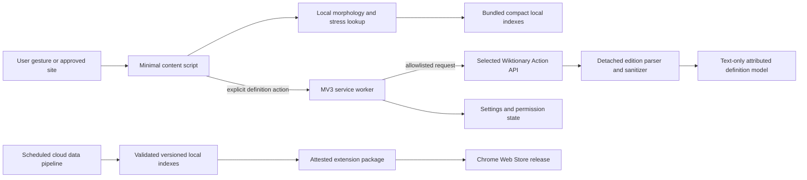

<!-- markdownlint-disable-file -->
# Task Research: slava-russian-dictionary-rearchitecture

| Field              | Value        |
|--------------------|--------------|
| Date               | 2026-10-03   |
| Researcher / agent | rpi-research |
| Output mode        | convergence  |

## Executive Summary

* Bottom line: Rebuild Slava as a small project-owned Manifest V3 extension, using WXT as build-time scaffolding and the Rikaikun/10ten/Yomitan projects as reference architectures rather than as a codebase to fork. Bundle compact stress and morphology data, and retrieve definitions from the live MediaWiki API only after explicit lookup. **Confidence: high for the confirmed direction and planning contract.**
* Why this matters: A direct port would retain broad page access, unpinned builds, live hover requests, raw remote HTML handling, whole-page mutation, and no automated tests. A full fork would import a large Japanese-specific GPL product and its maintenance burden. **Confidence: high.**
* Research status: Complete for planning. User decision D5 supersedes bundled definitions, and a focused second cycle established the live MediaWiki request, permission, response, parsing, privacy, attribution, and failure boundaries.
* Confidence and uncertainty: The project-owned MV3 shell, local stress/morphology assets, and one-request MediaWiki contract are strongly supported. Live edition markup remains changeable and must be isolated behind fixture-tested parsers and bounded smoke tests.

## What You May Not Know

* Rikaichan descendants are applications, not reusable language-neutral frameworks. Their useful assets are patterns: event-driven MV3 boundaries, dictionary backends, browser tests, visual tests, release automation, and fallback behavior. Their lookup and linguistic layers are Japanese-specific, and the active candidates are GPL-3.0. **Confidence: high.**
* “Cloud-based indexing” remains limited to local stress and morphology assets. Explicit definition lookups now contact Wikimedia directly; no Slava-hosted lookup service or definition corpus is planned. **Confidence: high.**
* Chrome requires host permissions for cross-origin requests made by an extension service worker even when Wikimedia supports CORS. The minimum definition permission set is therefore the four exact HTTPS Wiktionary origins, not a wildcard and not zero host permissions. **Confidence: high.**
* The stress index need not dominate extension size. A public Russian stress marker encodes 2,039,133 accented forms in a 721,732-byte finite-state automaton. The richer definitions, examples, attribution, and morphology are the large part. **Confidence: high for feasibility, moderate for the final Slava size.**
* Chrome treats locally processed website content as user data that still needs disclosure. “Nothing leaves your device” is a strong privacy property, but it does not remove the need for a privacy policy and clear permission explanations. **Confidence: high.**
* Extension code and Wiktionary-derived data should have separate licenses. The new code can be permissively licensed; transformed Wiktionary data remains subject to attribution and ShareAlike obligations. **Confidence: high; legal review remains prudent.**

## Findings

### Reuse architecture patterns, not a Rikaichan-family codebase

Rikaikun, 10ten Japanese Reader, and Yomitan are actively maintained MV3-capable products with serious test and release practices. They validate the architectural pattern of a thin content layer, background dictionary service, local database, browser-specific build output, and automated browser testing. They are poor foundations for a Russian extension because their linguistic algorithms, schemas, UI scope, and update machinery are deeply Japanese-specific; all three current repositories are GPL-3.0 or GPL-3.0-or-later.

WXT is a better meaning of “framework” for this project. It is MIT-licensed, active, generates explicit browser/MV3 manifests, uses Vite-based builds, supports Chrome and Firefox targets, and has first-class Vitest plus Playwright guidance. It is build-time scaffolding, not a requirement to adopt React or a large runtime. The target should keep domain code independent of WXT entrypoint conventions so it can be ejected if maintenance declines.

* Questions: Q2, Q3
* Evidence state: evidence-backed finding
* Evidence: W4, W5, W9, W10, W12
* Confidence and limits: High. No candidate provides a Russian-neutral framework; the conclusion could change if an actively maintained, permissively licensed Russian hover-dictionary core appears.

### The current implementation should be treated as behavioral evidence, not migration material

The repository establishes valuable product behavior: normalize Russian forms, map inflected words to lemmas and stress positions, annotate page text, and show multilingual Wiktionary definitions. Its implementation boundaries are unsuitable for preservation:

* Manifest V2 requests both `activeTab` and `<all_urls>`, installs a loader on every page, and uses deprecated script injection APIs.
* The background context loads complete JSON dictionaries into memory and stores activation state in process-local variables.
* Hovering fetches parsed Wiktionary HTML for each lemma and inserts selected remote markup into the page.
* The content script transforms every page text node and appends a very large inline CSS reset.
* Packaging downloads unpinned JavaScript and CSS directly from several CDNs; Python dependencies are unconstrained with `*`.
* No tests, CI workflows, lockfile, tracked generated assets, reproducible build record, or security policy exist. The latest repository commit predates this research by more than six years.

The new implementation should preserve only externally observable behavior that passes explicit product tests. It should not retain jQuery, Bootstrap, Underscore, live page parsing, current background state management, or the package script.

* Questions: Q1, Q3, Q5, Q6
* Evidence state: evidence-backed finding
* Evidence: C1-C7, W1-W3
* Confidence and limits: High. Generated production indexes are absent from the repository, so the old packaged size and real lookup corpus were not measured.

### Recommended target architecture

The recommended architecture has four independently testable boundaries:

1. **Extension shell:** TypeScript with WXT, no UI framework by default, explicit generated manifest inspection, and a small Shadow DOM popup. Use text nodes and structured DOM APIs, never `innerHTML` replacement or raw dictionary HTML.
2. **Page integration:** `activeTab` for one-off use, plus optional per-site host permissions for persistent activation. Register content scripts only for sites the user has approved. Offer an explicit all-sites grant only as a user choice.
3. **Lookup:** Ship compact immutable stress and morphology indexes so page annotation and lemma resolution work offline. After an explicit definition action, the service worker sends only the lemma and selected edition to an allowlisted Wiktionary Action API, parses the Russian-language section into a typed text-only model, and makes one English attempt only when a non-English edition has no usable result.
4. **Data updates:** Rebuild only local stress and morphology assets in cloud CI and release them inside a new attested extension package. Live definitions are not build inputs and are not reproducible release artifacts. The release pipeline must retain previous packages and block publication when local schema, quality, integrity, or size gates fail.

The service worker should orchestrate permission, settings, and remote definition requests; it should not hold the only live copy of the local indexes. Content scripts must send typed lemma requests rather than arbitrary URLs, and neither the page URL nor surrounding text may enter the remote request.

* Questions: Q3, Q4, Q6
* Evidence state: evidence-backed finding
* Evidence: W1-W7, W9
* Confidence and limits: High for boundaries; moderate for final Chromium lookup performance until the packaged local indexes are benchmarked.

### Use a deterministic cloud pipeline for local indexes, not definitions

The existing pipeline enumerates categories and stores parsed live pages, which is brittle and difficult to reproduce. The replacement should consume a dated Wikimedia dump or a dated Kaikki/Wiktextract extraction. Kaikki records the source dump date and exact extractor commits, which is a useful upstream provenance chain.

Recommended pipeline contract:

1. A scheduled or manually dispatched GitHub Actions workflow checks for a new dated source snapshot.
2. It downloads by immutable version, verifies the upstream digest where available, and records source URL, dump date, tool commit, configuration digest, and licenses.
3. A pinned toolchain filters Russian entries and emits a documented intermediate schema rather than scraping HTML.
4. Deterministic transformers build separate local artifacts: compact stress index, exact morphology index, attribution/source manifest, and quality report.
5. Quality gates compare counts and coverage with the previous release; fail on unexplained losses, malformed entries, excessive ambiguity changes, invalid Unicode, schema drift, or size-budget regressions.
6. Golden-corpus tests cover high-frequency words, `ё/е`, hyphenation, capitalization, inflection, multiple valid stresses, homographs, and known source defects.
7. Release jobs generate checksums, SBOMs, build provenance attestations, and the complete extension ZIP containing the validated local assets. Publication uses least-privilege workflow permissions and a separate approval boundary from pull-request CI.

GitHub Actions is sufficient initially; a managed cloud service is not justified until dataset processing exceeds runner limits or requires private infrastructure. The data contract should keep the transformer runnable locally and in any containerized CI.

* Questions: Q4, Q5, Q6
* Evidence state: evidence-backed finding
* Evidence: C4-C6, W7, W8, W11
* Confidence and limits: High. Full raw-dump extraction cost was not benchmarked; using Kaikki as the initial upstream materially reduces pipeline complexity.

### Make package and runtime size explicit release requirements

Bundling the local indexes removes duplicate storage and update machinery, while live definitions remove the definition corpus from the package. The release should report compressed ZIP size, installed size, peak lookup memory, and per-tab cache use.

Public compact-FSA evidence is confirmed: the complete MIT Russian Stress Marker dictionary is 721,732 bytes raw and 517,442 bytes zipped. It is a compact baseline rather than a sole authority because it matched 46.88% of the stress-bearing Kaikki sample, disagreed on 454 keys, and intentionally omits homographs. A hybrid Russian stem-plus-ending-paradigm index reproduces the sampled form-to-lemma relation exactly while reducing the filtered lookup-index projection from 35.3 MB to 13.2 MB compressed. The selected architecture therefore starts near 13.7 MB of compressed local data before extension code, with zero packaged definition bytes. **Confidence: high for sample correctness and relative savings, moderate for the full-corpus and final package projections.**

* Questions: Q3, Q4
* Evidence state: partially supported claim
* Evidence: W5, W6
* Confidence and limits: Moderate. The numerical budgets are proposed engineering gates, not measured outcomes.

### Use one bounded Action API request per edition attempt

The MediaWiki Action API provides the smallest workable contract for live definitions. A GET request to `https://{edition}.wiktionary.org/w/api.php` can use `action=parse`, `page=<lemma>`, `prop=text|tocdata|revid|displaytitle`, `format=json`, `formatversion=2`, `redirects=1`, `origin=*`, `disableeditsection=1`, and `disablelimitreport=1`. The response supplies parsed HTML, a revision ID, a resolved page title, redirect information, and table-of-contents anchors in one request. `prop=sections` is deprecated; `prop=tocdata` is the supported replacement.

The extension should not make a table-of-contents request followed by a section request. For the representative word `говорить`, requesting section 1 still returned 22-176 KB of HTML and would add a second network round trip. One whole-page response is simpler, preserves the revision and heading context, and permits the parser to isolate the Russian-language subtree locally. The parser must not rely on one shared selector because the editions differ:

* English uses an `h2` Russian section and POS headings such as `h3#Verb`, followed by ordered definition lists.
* French uses an `h2#Russe` section; `tocdata.line` may itself contain markup; POS headings such as `h3#Verbe` precede ordered lists.
* German uses a heading such as `h2#говорить_(Russisch)` and represents definitions under a bold “Bedeutungen:” label followed by definition-list entries rather than a universal definition heading.
* Russian uses `h1#Русский`, an `h4#Значение` heading, and ordered definition lists.

A 60-request serial probe across 15 representative Russian words and four editions found median parsed-HTML sizes of approximately 109 KB (`en`), 26 KB (`fr`), 26 KB (`de` among present pages), and 208 KB (`ru`). The largest sampled page was 776 KB of HTML and 878 KB of JSON. This supports a 2 MiB decoded-response ceiling with a lower warning threshold, but not an assumption that responses are small. German returned missing-page errors for four of the fifteen words, reinforcing the need for labelled English fallback. Under `formatversion=2`, missing pages return an `errors` array containing `code: "missingtitle"`, not the older singular `error` object.

Chrome MV3 service-worker fetches require manifest `host_permissions` for each remote origin. CORS support does not remove that requirement. The minimum static permission set is the four exact HTTPS origins for `en`, `fr`, `de`, and `ru`; wildcard Wiktionary or all-HTTPS permissions are unjustified. Wikimedia accepts anonymous browser CORS with `origin=*`, and a preflight probe confirmed `Api-User-Agent` is allowed. The client must identify itself, serialize requests, use GET, follow throttling instructions, and apply bounded backoff. `maxlag` is intended for non-interactive work and should not delay an interactive dictionary lookup.

The upstream HTML is untrusted remote data even though MediaWiki has parsed it. It must be parsed in a detached document, reduced to a typed text-only intermediate model, and rendered with DOM text APIs. Definition requests accept an edition and normalized lemma, never an arbitrary URL. The runtime must reject an unexpected final origin, non-JSON response, malformed contract, unsupported redirect, oversized body, timeout, abort, or unusable Russian section with a bounded typed error. No persistent Slava definition cache is required; ordinary browser HTTP caching may operate.

* Questions: Q3, Q5, Q6
* Evidence state: evidence-backed finding with representative live probes
* Evidence: C3, W14-W20
* Confidence and limits: High for API, permission, CORS, and response-shape contracts. Moderate for long-term parser stability because community-edited edition markup can change without a versioned schema.

### A complete automated quality pipeline needs product, data, browser, and release tests

A “full automated pipeline” should include:

| Gate | Required checks |
|------|-----------------|
| Pull request | Formatting, lint, TypeScript strict mode, unit tests, dependency review, license policy, CodeQL, generated-manifest permission diff, compiled-output scan for remote code and forbidden APIs |
| Domain unit | Unicode normalization, stress placement, form-to-lemma mapping, ambiguity handling, ranking, schema validation, digest/signature verification |
| Property/fuzz | Arbitrary Unicode, combining marks, malformed local-index records, DOM mutation sequences, hostile remote markup, oversized inputs |
| Data build | Determinism, source provenance, count/coverage deltas, golden corpus, duplicate/conflict reports, license and attribution generation |
| Browser integration | Load the unpacked MV3 extension, terminate/restart the service worker, grant/deny permissions, activate/deactivate per site, mutate SPA content, render accessible popup, and verify local operation plus explicit online-definition failure states |
| Remote-definition contract | Versioned English/French/German/Russian HTML fixtures, missing pages, redirects, malformed JSON, hostile markup, oversized bodies, timeout, abort, throttling, and English fallback |
| Privacy regression | Intercept all network requests and prove that only an explicitly requested lemma and selected edition reach the four exact Wiktionary endpoints; page URL, surrounding text, passive hover terms, and browsing history never leave the browser |
| Performance | Package and local-index budgets, cold/warm lookup latency, page activation cost, memory ceiling, large-page behavior |
| Release | Build from tag and locked dependencies, reproduce package, create SBOM and provenance attestation, verify artifact, run smoke tests against the exact ZIP, then require a separate store-publish approval |

Playwright officially supports MV3 extension service-worker and popup testing in persistent Chromium contexts. WXT provides Vitest extension API fakes and points to Playwright for end-to-end testing. Maintained peer projects demonstrate broad unit, browser, visual, and build validation.

* Questions: Q5
* Evidence state: evidence-backed finding
* Evidence: W4, W5, W9-W11
* Confidence and limits: High. Exact GitHub feature availability depends on repository visibility and account settings.

### Promise enforceable privacy and security properties, not absolute safety

The extension can make strong, testable commitments:

* Word detection, stress insertion, morphology, and lemma resolution occur locally.
* No analytics, advertising SDK, account, telemetry, browsing-history collection, or developer-operated lookup API.
* Page URLs, surrounding text, passive hover terms, browsing history, and unrelated page content are never transmitted.
* A definition request occurs only after an explicit user action and sends the normalized lemma and selected edition directly to Wikimedia. Wikimedia also receives ordinary network metadata and the user's IP address.
* Remote requests are limited to the four exact HTTPS Wiktionary origins plus Chrome Web Store update traffic; no wildcard remote-fetch permission or developer-controlled service is used.
* No remote executable code; all executable JavaScript/WASM is inside the reviewed extension package.
* Website access is temporary or explicitly granted per site, with a visible revocation control.
* Definitions are parsed from a bounded response into validated text fields and source links, never inserted as upstream HTML.
* Every published package and local data artifact has a source version, digest, license/attribution record, SBOM where applicable, and build provenance. Live definition content is attributed by edition, page, and revision but is not reproducible release content.
* Releases fail closed: invalid, incompatible, oversized, or unverifiable local assets cannot enter the published package. Runtime definition failures produce explicit unavailable/error states rather than success-shaped empty content.

Do not promise “secure,” “anonymous,” “zero risk,” fully offline definitions, or perfect dictionary correctness. Chrome policy defines website content and browsing activity as user data even when processed locally, so the store listing and privacy policy must distinguish local page processing from explicit Wikimedia definition traffic. Attestations establish how an artifact was built; they do not prove absence of defects or that the Chrome Web Store serves byte-identical artifacts unless that comparison is separately demonstrated.

* Questions: Q6
* Evidence state: evidence-backed finding
* Evidence: W2, W3, W8, W11
* Confidence and limits: High for enforceable properties; legal wording should be reviewed before publication.

### Additional requirements omitted from the initial brief

The following concerns materially affect the design:

* **Licensing and attribution:** Separate extension code, third-party dependencies, icons, and generated data into explicit license inventories.
* **Dictionary ambiguity:** Homographs and multiple valid stresses cannot be “fixed” by infrastructure. Preserve ambiguity and explain it rather than selecting a false certainty.
* **Accessibility:** Keyboard activation, focus management, screen-reader labels, reduced motion, color contrast, zoom, and popup dismissal need automated and manual coverage.
* **Reversibility:** Page changes must be removable without reload and must not destroy event handlers or application state.
* **SPA and editor compatibility:** Mutation handling, frames, shadow roots, content-editable fields, Google Docs, and virtualized pages require explicit support decisions.
* **Cross-browser portability:** Build Chrome first, but preserve WebExtension-compatible domain boundaries so Firefox/Edge packages do not require a rewrite.
* **Operational transparency without telemetry:** Surface local index version, source date, integrity state, storage use, and diagnostic export without sending diagnostics automatically.
* **Rollback and source withdrawal:** Retain previous accepted local-index sources and rebuild a replacement extension version when a bad data release must be revoked.
* **Performance budgets:** Measure activation, lookup, memory, and DOM mutation overhead on realistic pages before enabling automatic all-page processing.
* **Store-policy packaging:** Keep a single narrow purpose and document every requested permission and external endpoint.

* Questions: Q7
* Evidence state: evidence-backed finding
* Evidence: C1-C7, W2, W5, W8, W13
* Confidence and limits: High.

## Recommendation and Alternatives

* Recommendation or decision state: Selective reuse with a project-owned TypeScript/WXT extension, bundled local stress and morphology assets, and live MediaWiki API definition lookup after explicit user action.
* Rationale: This retains mature extension patterns without inheriting Japanese-specific GPL code, removes permanent definition storage and Slava hosting, and keeps passive page processing local. It accepts online-only definitions, Wikimedia request disclosure, live API variability, and weaker reproducibility for definition content. User decision D5 supersedes D2.
* What could change this result: MediaWiki API evidence showing that reliable bounded multilingual definition extraction is infeasible, unacceptable privacy or store-review consequences, or a later user decision to restore bundled or downloaded definition packs.

| Option | Benefits | Costs and risks | Evidence | Disposition |
|--------|----------|-----------------|----------|-------------|
| Project-owned WXT shell plus selective pattern reuse | Small, auditable, cross-browser-capable, permissive code license, modern tests | Requires domain implementation and careful data contracts | W4, W5, W9, W10 | Selected |
| Fork Rikaikun, 10ten, or Yomitan | Mature interaction, lookup, tests, and release ideas | GPL derivative; large Japanese-specific code and data model; high deletion burden | W4, W5, W12 | Rejected |
| Raw TypeScript/Vite without WXT | Maximum build transparency and minimal dependencies | Recreates manifest, browser-target, packaging, and test scaffolding | W9 | Viable fallback |
| Bundle all definitions in every store package | Simplest offline model; one artifact; no download, import, storage, or rollback subsystem | Larger store package; every data refresh requires store review and extension update | W3, W6, D2 | Superseded by D5 |
| Optional downloaded definitions pack | Smaller initial package and independent data updates | Adds hosting, permissions, storage, integrity, migration, rollback, and offline-first complexity | W3, W5, W6 | Rejected by D5 |
| Live MediaWiki Action API lookup | No bundled or Slava-hosted definitions; one request supplies HTML, revision, title, and heading anchors | Sends explicit lookup content and IP to Wikimedia; online-only; four exact host permissions; edition-specific parser variability; weaker reproducibility | W14-W20, D5 | Selected |
| Slava-hosted lookup API or shards | Stable schema and centralized updates | Creates Slava hosting, availability, logging, privacy, and operations obligations | W2, W3 | Rejected by D5 |
| Direct MV3 port | Fastest resubmission | Preserves debt, permissions, live requests, unsafe rendering boundary, and absent quality system | C1-C7 | Rejected |

## Scope and Questions

* Goal: Select an evidence-supported target architecture for a ground-up rearchitecture of Slava Russian Dictionary.
* Audience and use: The maintainer will challenge the evidence and use the result as implementation-plan input.
* In scope: Current repository architecture; maintained similar open-source extensions; extension frameworks; Manifest V3 constraints; automated tests and CI; dictionary/index build and distribution; extension size; privacy, security, update, supply-chain, licensing, and operational guarantees.
* Out of scope: Editing production source, deploying cloud resources, publishing the extension, drafting an implementation plan, or performing an exploit-focused security review.
* Decision and evidence criteria: Functional fit, maintainability, project health, license compatibility, MV3 compliance, offline behavior, latency, package/storage size, reproducibility, testability, privacy, security, operational cost, accessibility, and migration risk.
* Requested output: Comparative convergence recommendation with explicit residual decisions.

| ID | Question | Source | Status |
|----|----------|--------|--------|
| Q1 | What does the current extension do, and which liabilities should not be carried forward? | Inferred from user direction and repository | Answered |
| Q2 | Which maintained similar projects or frameworks are credible reuse candidates? | Explicit | Answered |
| Q3 | What MV3 architecture best fits instant dictionary lookup with minimal permissions and size? | Inferred | Answered |
| Q4 | How should dictionary source data be built, verified, versioned, and delivered? | Explicit | Answered |
| Q5 | What automated test and CI/CD pipeline can provide meaningful confidence? | Explicit | Answered |
| Q6 | Which security and privacy guarantees are technically verifiable and safe to promise users? | Explicit | Answered |
| Q7 | Which important product or operational concerns are missing from the initial brief? | Explicit | Answered |
| Q8 | What exact MediaWiki request, permission, parsing, fallback, privacy, and failure contract can support live definitions? | Required by D5 | Answered |

## Decisions and Feedback

| Group | Decision or feedback item | Status | Owner | Rationale or input needed | Evidence | Impact of answer |
|-------|---------------------------|--------|-------|---------------------------|----------|------------------|
| D1 | Reuse strategy: own the Russian product and reuse patterns, not GPL application code | Confirmed by convergence | Evidence | Best fit for size, licensing, maintainability, and a clean architecture | W4, W5, W9, W12 | Establishes codebase foundation |
| D2 | Bundle rich definitions in every extension release | Superseded | User | Reopened after measured size review | W3, W5, W6, D5 | Bundling now applies only to local stress and morphology assets |
| D3 | Browser delivery: Chrome first with portable boundaries | Confirmed by scope | Constraint | Restores the removed Chrome product without designing Chrome-only domain code | W9, W10 | Sets first release matrix |
| D4 | Target-language definitions with English fallback | Confirmed | User | A selected French, German, or Russian definition should be shown when available; English is the mandatory per-entry fallback | User input 2026-10-03; current Kaikki English/French/German/Russian editions | Adds German source data, target-language settings, resolved-language UI, and cross-edition alignment tests |
| D5 | Retrieve definitions from the live MediaWiki API with no Slava-hosted definition data | Confirmed and replanned | User | Avoid permanent definition storage and Slava hosting; accept online-only definitions and Wikimedia request disclosure | User answer during `/hve-core:rpi-implement`; focused cycle 2 | Defines parsing, fallback, privacy, permissions, tests, failure handling, and release guarantees |

## Risks and Open Questions

| Priority | Type | Risk, question, or research item | Impact | Smallest action or evidence needed | Owner |
|----------|------|----------------------------------|--------|------------------------------------|-------|
| H | Risk | Ambiguous stress and homographs may produce confidently wrong output | Damages learning value and trust | Define ambiguity policy and build a reviewed golden corpus | Downstream |
| H | Risk | Target-to-English fallback can mislead if a parser collapses unrelated homographs or returns non-Russian sections | Wrong definitions damage trust | Preserve all usable Russian-section alternatives, group by edition POS without asserting cross-edition sense equivalence, and fallback only when the selected edition has no usable result | Downstream |
| M | Constraint | The current complete German edition is sparse relative to English and therefore uses English fallback for most lookups | German can be supported correctly without providing broad German coverage | Publish measured per-edition coverage and make fallback language visible | Downstream |
| H | Risk | Edition markup or Action API response changes may silently reduce live extraction coverage | Definitions can disappear or be misclassified without a package update | Version fixtures, run bounded scheduled live canaries, report parser health, and fail visibly without rendering raw HTML | Downstream |
| H | Risk | Cross-origin definition access requires four host permissions | Store review and user trust are affected | Declare only exact `https://{en,fr,de,ru}.wiktionary.org/*` origins and explain them in-product and in store disclosures | Downstream |
| M | Risk | Representative pages can approach 1 MB decoded and may grow beyond the sample | Memory or denial-of-service exposure | Enforce timeout, abort, redirect/origin, content-type, and 2 MiB decoded-response ceilings and test oversized fixtures | Downstream |
| M | Open question | Support for editors, frames, Google Docs, and shadow DOM | Can expand complexity substantially | Define first-release supported-surface matrix | User/downstream |
| M | Risk | ShareAlike, attribution, and third-party entry material need precise handling | Publication or redistribution exposure | Produce code/data license inventory and obtain legal review if needed | Downstream |
| L | Further research | Whether a finite-state transducer or simpler sorted binary table wins for the final corpus | Affects a sub-megabyte component | Benchmark both against the same generated corpus | Downstream |

## Planning Readiness and Next Step

| Field                            | Record |
|----------------------------------|--------|
| Research disposition             | executed |
| Decision participation           | user-owned; standalone explicit invocation |
| Planning Readiness               | Ready: D5 and the live MediaWiki contract have evidence-backed request, permission, parsing, fallback, privacy, attribution, failure, and test boundaries |
| Research depth and helpers       | One expansive architecture cycle plus one focused MediaWiki cycle completed with Wider, Deeper, and Contrarian waves; no subagent helper used; sources verified directly where material |
| Blockers                         | None |
| Output mode and planning support | Convergence; supports implementation-ready replanning for D5 |
| Continuation owner               | User/manual RPI Agent |
| Required gates or confirmations  | Research-only boundary passed; material user decision and focused API evidence gap resolved |
| Next action                      | Use the authoritative implementation-ready plan and its critique disposition |
| Primary evidence file            | `.copilot-tracking/research/2026-10-03/slava-russian-dictionary-rearchitecture-research.md`; date supplied by current session context |

## Research Record

### Method and Boundaries

| Field                            | Record |
|----------------------------------|--------|
| Research posture and provenance  | expansive; selected because the brief was broad and the architecture, data, framework, and guarantee spaces were materially unknown |
| Completion basis                 | Material questions are answered, both research cycles converged, candidate sources became redundant, and remaining uncertainty is implementation-time parser maintenance rather than a planning blocker |
| Explicit limits or deadline      | No deadline or source-count limit supplied |
| Codebase and external scope      | Current SlavaTranslator worktree; official Chrome, MediaWiki/Wikimedia, Playwright, WXT, GitHub, Wiktionary and Kaikki documentation; active public dictionary-extension repositories; bounded live Action API probes |
| Initial candidate areas          | `chrome/`, `scripts/`, `conf/`, docs; Rikaikun/10ten/Yomitan; Russian stress projects; MV3; framework, CI, indexing, reproducibility, privacy, licensing, and size |
| Evidence root                    | Default repository root `.copilot-tracking/` |
| Constraints and excluded sources | Research only; no production code edits, planning, cloud mutation, store submission, secrets, or exploit review |
| Prior knowledge                  | Chrome removal notice established MV2 deprecation; repository and external claims were rechecked against current files and documentation |

### Extensions and Participation

#### Extension Registry

| Kind | Candidate | Provenance and scoped contract | Selected or skipped reason |
|------|-----------|--------------------------------|----------------------------|
| Skill | rpi-research | Explicit user invocation; owns research artifact, evidence state, and research-only boundary | Selected |
| Skill | architecture-review | Previously activated for architecture inventory | Skipped because explicit RPI research superseded it and this phase required a single reader-first research artifact |
| Instruction | Repository and user Copilot instructions | Apply to workspace and tracking artifact | Selected for current documentation, evidence handling, package access, and security discipline |
| Skill | security review | Applies to explicit vulnerability discovery | Skipped because the task selected target controls and guarantees rather than seeking exploitable vulnerabilities |
| Documentation | Context7 Chrome Extensions, Playwright, and WXT | Required for current framework/API documentation | Selected and corroborated with primary pages and repositories |

#### Direction and Participation Log

| Checkpoint or change | Question, direction, or rationale | Answer or no-interaction reason | Result and revalidation effect |
|----------------------|-----------------------------------|--------------------------------|--------------------------------|
| Intake | Direct port or ground-up rearchitecture | User explicitly requested ground-up rearchitecture with reuse, tests, cloud indexing, size, and security goals | Minimal MV3 port excluded |
| Intake | Research posture | No question required: broad brief and materially unknown decision space | Expansive posture selected |
| Intake | Output mode | User requested architecture direction, not analysis alone | Convergence selected |
| Intake | Participation | Standalone manual RPI invocation | User-owned material decisions |
| Synthesis | Reuse candidate | Evidence showed active peers are GPL products rather than Russian-neutral frameworks | Selective pattern reuse recommended |
| Synthesis | Data delivery | Both optional and bundled definitions remained viable and materially affected architecture | User selected bundled definitions; remote pack subsystem removed |
| Implementation handoff | Definition delivery reopened | User selected direct live MediaWiki lookup with no Slava-hosted definition data | D2 superseded; focused cycle 2 activated |
| Cycle 2 synthesis | Request strategy and permissions | Official docs and live probes support one whole-page parse request with exact hosts | Four exact host permissions, typed parsers, English fallback, and runtime limits become planning requirements |

### Research Cycle Log

#### Cycle 1

* Active posture, controls, and limits: Expansive; research-only; current repository plus authoritative public sources and credible active repositories.

##### Wave 1: Wider

* Focus and questions: Current implementation census; comparable products; MV3 requirements; frameworks; test/release practices; Russian data sources; compact indexes; privacy and supply-chain controls.
* Evidence: C1-C7 and W1-W13 established the current debt, active candidate landscape, browser constraints, data provenance options, compact stress feasibility, and CI/release controls.
* Reflection: Full-product reuse was deprioritized because current candidates are GPL and language-specific. The research prioritized a thin shell, independent data contracts, local lookup, and verifiable release properties.

##### Wave 2: Deeper

* Focus and questions: Candidate manifests, package scripts, test inventories, 10ten dictionary backend/update behavior, WXT build/test contracts, Playwright MV3 testing, Russian FSA size, Kaikki provenance, Wiktionary licensing, and Chrome privacy/permission policy.
* Evidence: Active peers use MV3 service workers, local dictionary backends, broad tests, and automated packaging. A compact Russian FSA demonstrates that stress data can be bundled. Chrome permits remote data but requires local code, minimum permissions, and disclosures.
* Reflection: Both fully bundled and hybrid architectures were viable. The fully bundled option has the simpler failure model and strongest no-network commitment, subject to package-size validation.

##### Wave 3: Contrarian

* Focus and questions: Whether remote packs, IndexedDB, WXT, optional permissions, and provenance add more risk than value; whether fully bundled data or raw TypeScript is safer.
* Evidence: Remote packs add network, storage, schema, rollback, and review complexity; service workers are ephemeral; optional permissions add user friction; build frameworks add dependencies. Bundling all data and raw TypeScript remain simpler alternatives. W3, W6, W9 and W11.
* Reflection: The challenge weakened the remote-pack design. The user subsequently selected full bundling, removing extension-managed download, IndexedDB import, schema migration, and local rollback machinery. WXT remains selected, with explicit generated-manifest inspection and domain-code isolation to limit lock-in.

##### Synthesis and Re-entry

| Material or claim | Evidence | Disposition | Rationale | User-facing effect |
|-------------------|----------|-------------|-----------|--------------------|
| Fork an existing dictionary extension | W4, W5, W12 | Rejected | Language-specific GPL application code creates more inherited complexity than reusable value | Selective pattern reuse |
| Use WXT as build scaffolding | W9, W10 | Accepted | Active, permissive, cross-browser, minimal UI assumptions, strong test path | Recommended shell |
| Perform user lookups in cloud | W2, W3 | Superseded by D5 | User later selected direct live MediaWiki definitions after size review | Local stress/morphology; explicit remote definitions |
| Bundle compact stress data | W6 | Accepted | Demonstrated sub-megabyte FSA feasibility for more than two million forms | Immediate offline core |
| Bundle definition data in the extension | W3, W5, W6, D2 | Superseded by D5 | User selected live definitions after measured package review | Zero definition bytes in package |
| Use live Wiktionary HTML | C3, W7, W8 | Superseded by bounded D5 contract | Raw insertion remains rejected; detached edition parsing into a text-only model is selected | Explicit attributed live definitions |

* Another complete three-wave cycle needed: Yes, after D5 superseded the definition-delivery architecture.
* Trigger or stop basis: Cycle 1 was sufficient for its then-current bundled decision; D5 created a decision-critical API evidence gap.
* Readiness or revalidation effect: Cycle 1 no longer established final readiness on its own.

#### Cycle 2

* Active posture, controls, and limits: Focused; research-only; official Chrome and Wikimedia documentation, legacy behavior, and bounded serial live probes against the four selected Wiktionary editions.

##### Wave 1: Wider

* Focus and questions: Action API versus REST/Parsoid; anonymous CORS; browser identification; rate etiquette; Chrome MV3 cross-origin permissions; attribution and API-change obligations.
* Evidence: W14-W18 establish `action=parse`, `tocdata`, anonymous `origin=*`, `Api-User-Agent`, serialized GET requests, throttling compliance, and exact host-permission requirements.
* Reflection: No language-neutral structured dictionary-definition API was found. REST/Parsoid still returns edition-specific HTML, so it does not remove the parser boundary.

##### Wave 2: Deeper

* Focus and questions: Live response shapes, edition headings and definition containers, missing pages, response sizes, section-request trade-offs, and browser CORS preflight behavior.
* Evidence: W19 and W20 cover 60 serial requests across 15 words and four editions, a dedicated missing-page probe, one-request versus section-response measurements, and an `Api-User-Agent` preflight check. The largest sampled JSON response was 878 KB; `formatversion=2` returned missing pages through an `errors` array.
* Reflection: One whole-page request per edition attempt is simpler and usually cheaper than a table-of-contents request plus a still-large section request. Edition parsers must remain separate and fixture-owned.

##### Wave 3: Contrarian

* Focus and questions: Whether direct live parsing is too brittle for the requested security and reliability guarantees; whether a Slava proxy, packaged definitions, or downloadable packs should replace D5.
* Evidence: Live HTML is variable, remote content is non-reproducible, German coverage is sparse, and common pages can be hundreds of kilobytes. A proxy would create new hosting, availability, logging, and privacy obligations; bundled or downloaded definitions contradict D5.
* Reflection: D5 remains feasible only with explicit online/error UX, exact host permissions, strict response limits, detached text-only parsing, edition fixtures, bounded live canaries, and truthful privacy disclosure. Availability cannot be guaranteed.

##### Synthesis and Re-entry

| Material or claim | Evidence | Disposition | Rationale | User-facing effect |
|-------------------|----------|-------------|-----------|--------------------|
| Use one whole-page `action=parse` request | W14, W19, W20 | Accepted | Supplies HTML, revision, resolved title, redirects, and heading anchors in one request | At most one target attempt plus one English fallback attempt |
| Discover headings with `prop=sections` | W14 | Rejected | Deprecated; `tocdata` is the supported response property | Parser contract uses `tocdata` |
| Avoid Wiktionary host permissions because CORS is enabled | W17, W18 | Rejected | Chrome requires host permissions for service-worker cross-origin fetches | Four exact HTTPS Wiktionary origins are disclosed |
| Render parsed MediaWiki HTML | C3, W18-W20 | Rejected | Remote markup is an XSS and page-integrity boundary | Text-only typed model rendered with DOM APIs |
| Add a persistent Slava definition cache | D5, W15 | Rejected for first release | Not required by the user; creates storage, expiry, deletion, and stale-content behavior | Definitions remain online-only apart from ordinary HTTP caching |
| Treat API availability as guaranteed | W15 | Rejected | Wikimedia may throttle, modify, or retire APIs | Explicit offline/throttled/unavailable/API-change states |

* Another complete three-wave cycle needed: No.
* Trigger or stop basis: Official sources and live probes converge on one bounded implementation contract; remaining parser drift is a known runtime risk with planned detection and fallback.
* Readiness or revalidation effect: Focused research gap is closed; implementation-ready planning may proceed.

### Full-Corpus Kaikki Semantic Audit

The pinned Kaikki corpus was streamed in full after manual tests exposed that `forms[]` mixes inflections, aspect partners, derivations, alternatives, and shared table rows. The audit covered all 442,594 records, 2,914,519 form records, 401,676 `form_of` senses, and 3,075 `alt_of` senses.

#### Implemented Findings

| Finding | Corpus evidence | Resolution |
|---------|-----------------|------------|
| Aspect partners were treated as inflections | 12,067 aspect edges; 10,863 targets exist in the corpus | Store aspect and counterpart metadata separately; do not assign counterpart ownership |
| Form-of entries carried stress that was discarded | 412,083 accented canonical form-of spellings | Retain exact stress evidence and union valid positions across packaged sources |
| Derivational relatives polluted morphology | 5,268 relational adjectives, 2,697 feminine counterparts, 2,132 diminutives, 1,140 adverbs, and other lexical classes | Exclude unsourced derivational/lexical-relative forms while retaining true grammar and alternatives |
| Shared pronoun tables created extreme ambiguity | Common pronoun surfaces resolved to eleven to fifteen unrelated pronoun lemmas | Ignore noncanonical pronoun table rows and use explicit inflectional `form_of` targets |
| Alternative spellings were discarded | 2,430 eligible non-self `alt_of` targets | Follow lexical alternatives such as `сел` → `сёл` |
| Abbreviation senses fanned out excessively | `л` expanded to twelve referenced pages | Keep the exact abbreviation page; do not auto-follow abbreviation/acronym/initialism/letter/morpheme/clipping/ellipsis targets |
| Secondary grave stress prevented matches | Residual targets included `тё̀мно-зелёный`, `ню̀й-шу`, and similar spellings | Strip combining grave at the stress-normalization boundary while preserving `ё` |

After the generic corrections, 384,717 of 389,265 token-shaped `form_of` targets are covered. The 4,548 deliberately uncovered relations are predominantly lexical derivations or passive/reflexive relationships such as diminutives and gendered noun counterparts. Candidate fan-out fell from a maximum of seventeen to six; no audited surface retains eight or more candidates. Ordinary `alt_of` coverage remains complete apart from intentionally excluded abbreviation expansions and a small set of unusual diaeresis spellings.

#### Additional Opportunities

| Opportunity | Evidence | Recommendation |
|-------------|----------|----------------|
| Local grammatical labels beyond aspect | Canonical forms carry noun gender/animacy/number and adjective/verb grammar at broad coverage | Run a size/UX spike before adding compact grammar metadata; aspect has immediate value and is implemented |
| Offline inflection analysis | Most of 401,676 `form_of` senses include case, number, person, tense, mood, participle, or degree tags | Consider a compact per-surface grammar table if instant offline parsing becomes a product requirement |
| Pronunciation | 439,238 records contain `sounds` data | Keep out of the first release; storing IPA/audio metadata would expand scope and package size |
| Related and derived words | 11,036 records contain `related` and 4,413 contain `derived` | Do not auto-fetch as definitions; consider an explicit opt-in related-words section later |
| Missing/nonreciprocal aspect targets | 1,204 aspect edges point outside the retained lemma set and 1,754 are nonreciprocal | Preserve as a follow-up data-quality metric; do not invent reciprocal relationships |
| Contextual stress disambiguation | Forms such as `году` legitimately have multiple stresses selected by syntax | Continue ambiguity-preserving rendering; contextual NLP would be a separate feature and data budget |

### Evidence Log

* Helpers: None. Web search outputs were treated as discovery aids; material claims were checked against repository files or primary documentation.

| ID | Claim or finding | Source or location | Retrieved and version | Tool | Confidence | Notes |
|----|------------------|--------------------|-----------------------|------|------------|-------|
| C1 | Current extension is MV2 and requests broad page access | `chrome/manifest.json` manifest fields | not applicable | Read/search | High | Also installs loader on all URLs |
| C2 | Current background loads whole JSON indexes and keeps activation in volatile globals | `chrome/background.js` initialization and message listener | not applicable | Read | High | Incompatible with MV3 lifecycle without redesign |
| C3 | Hover lookup sends lemma requests to Wiktionary and renders parsed remote HTML | `chrome/content_script.js` `get_entries` and `parse_wiki` | not applicable | Read/search | High | Page content/lookup leaves local-only boundary |
| C4 | Packaging downloads unpinned libraries from several CDNs | `scripts/package-extension.sh` | not applicable | Read/search | High | No digest or lock |
| C5 | Python dependencies are unconstrained | `scripts/Pipfile` packages | not applicable | Read/search | High | Reproducibility gap |
| C6 | Existing build creates JSON word and form indexes from downloaded pages | `scripts/build-indexes.py` main pipeline | not applicable | Read | High | Useful behavioral evidence, inefficient update boundary |
| C7 | Repository has no tests or CI and latest commit is 2020-08-31 | Git history and tracked-file census | not applicable | Git search | High | Generated assets absent |
| W1 | MV3 service workers are ephemeral and state must be persisted | Chrome Extensions migration documentation, https://developer.chrome.com/docs/extensions/develop/migrate/to-service-workers | 2026-10-03, current | Context7/primary docs | High | Listener and storage design constraint |
| W2 | Chrome requires minimum permissions and disclosure of local website-content handling | Chrome user privacy and user data FAQ, https://developer.chrome.com/docs/extensions/develop/security-privacy/user-privacy and https://developer.chrome.com/docs/webstore/program-policies/user-data-faq | 2026-10-03, current | Primary docs | High | Supports activeTab and optional hosts |
| W3 | MV3 forbids remote code but permits remote JSON/data | Chrome remote hosted code guidance, https://developer.chrome.com/docs/extensions/develop/migrate/remote-hosted-code | 2026-10-03, current | Primary docs | High | Enables data packs, not dynamic logic |
| W4 | Active dictionary peers use MV3, TypeScript/modern JS, and substantial tests | Rikaikun, 10ten, Yomitan repositories and package manifests | 2026-10-03, current default branches | GitHub/raw source | High | Repository activity verified |
| W5 | 10ten implements local dictionary update/backends and tests update/search behavior | 10ten `jpdict.ts`, `jpdict-backend.ts`, tests, https://github.com/birchill/10ten-ja-reader | 2026-10-03, version 1.28.0 | Raw source | High | Reference pattern, not reusable Russian code |
| W6 | 2,039,133 accented forms fit in a 721,732-byte FSA dictionary | Russian Stress Marker README and repository tree, https://github.com/zdarsch/russian-stress-marker | 2026-10-03, main | GitHub/raw source | High | Implementation itself is not suitable to copy wholesale |
| W7 | Kaikki records source dump date and extractor commits | Kaikki raw data page, https://kaikki.org/dictionary/rawdata.html | 2026-10-03; extraction 2026-09-28 from dump 2026-09-02 | Primary project page | High | Strong initial upstream for deterministic filtering |
| W8 | Wiktionary entries are CC BY-SA 4.0 and GFDL with attribution/share-alike obligations | Wiktionary copyrights, https://en.wiktionary.org/wiki/Wiktionary:Copyrights | 2026-10-03, current | Primary source | High | External materials can carry separate terms |
| W9 | WXT supports generated MV3/cross-browser builds and Vitest integration | WXT docs/repo, https://github.com/wxt-dev/wxt | 2026-10-03, current | Context7/GitHub | High | MIT, active |
| W10 | Playwright supports unpacked MV3 extension and service-worker E2E tests | Playwright extension documentation, https://playwright.dev/docs/chrome-extensions | 2026-10-03, v1.63.0 | Context7/primary docs | High | Use bundled Chromium |
| W11 | GitHub supports artifact/SBOM attestations and least-privilege Actions permissions | GitHub Actions docs, https://docs.github.com/en/actions/how-tos/secure-your-work/use-artifact-attestations/use-artifact-attestations | 2026-10-03, current | Primary docs | Attestation is provenance, not correctness proof |
| W12 | Rikaikun, 10ten, and Yomitan are GPL-3.0-family products | Repository license metadata and package manifests | 2026-10-03, current | GitHub/raw source | High | Copying code affects licensing strategy |
| W13 | Store policy requires a narrow purpose and justified permissions | Chrome quality guidelines, https://developer.chrome.com/docs/webstore/program-policies/quality-guidelines-faq | 2026-10-03, current | Primary docs | Supports focused product scope |

| W14 | `action=parse` can return parsed text, `tocdata`, revision, display title, redirects, and a selected section; `prop=sections` is deprecated | MediaWiki API: Parsing wikitext, https://www.mediawiki.org/wiki/API:Parsing_wikitext | 2026-10-03, current | Context7/primary docs | High | Supports one-request contract and rejects deprecated sections property |
| W15 | API clients should serialize GET requests, identify themselves, follow throttling, back off, and cache where appropriate; API availability is not guaranteed | MediaWiki API etiquette and Wikimedia API Usage Guidelines, https://www.mediawiki.org/wiki/API:Etiquette and https://foundation.wikimedia.org/wiki/Policy:Wikimedia_Foundation_API_Usage_Guidelines | 2026-10-03, current | Primary docs | High | Interactive requests omit `maxlag`; runtime handles throttling and change |
| W16 | Anonymous cross-site Action API requests use `origin=*`; browser applications should send `Api-User-Agent` | MediaWiki cross-site requests and Wikimedia User-Agent policy, https://www.mediawiki.org/wiki/API:Cross-site_requests and https://foundation.wikimedia.org/wiki/Policy:User-Agent_policy | 2026-10-03, current | Primary docs | High | Browser identification and CORS contract |
| W17 | Chrome extension service workers need declared host permissions for cross-origin fetch; content scripts remain subject to page-origin CORS | Chrome cross-origin network requests, https://developer.chrome.com/docs/extensions/develop/concepts/network-requests | 2026-10-03, current | Context7/primary docs | High | Requires four exact Wiktionary origins and background-owned requests |
| W18 | Chrome requires remote responses to be treated as untrusted and warns against `innerHTML` and arbitrary-URL message handlers | Chrome extension network-request security guidance, https://developer.chrome.com/docs/extensions/develop/concepts/network-requests | 2026-10-03, current | Context7/primary docs | High | Typed lemma requests and text-only rendering |
| W19 | Live `говорить` probes confirmed CORS `*`, revision IDs, edition-specific Russian section anchors, distinct POS/definition markup, and successful `Api-User-Agent` preflight on all selected editions | Serial Action API probes against `en`, `fr`, `de`, and `ru` Wiktionary | 2026-10-03, live revisions recorded during probe | Direct API | High for observed responses | English/French ordered lists, German “Bedeutungen” definition lists, Russian `Значение` ordered lists |
| W20 | A 60-request representative probe found median HTML sizes of 26-208 KB, a sampled maximum of 776 KB HTML/878 KB JSON, German missing pages, and `formatversion=2` `errors[]` missing-title responses | Serial Action API probes across 15 Russian words and four editions | 2026-10-03, live | Direct API | Moderate | Supports 2 MiB decoded ceiling and labelled English fallback; not a corpus-wide upper bound |

#### Contradictions and Conflicts

* Early search summaries incorrectly described 10ten as MPL-2.0; its current repository and package manifest state GPL-3.0-or-later. Repository evidence controls.
* Search summaries suggested no explicit package-size ceiling and several storage-limit figures without adequate primary support. The recommendation therefore uses proposed project budgets and requires measurement rather than asserting browser limits.
* A remote-pack-only architecture initially appeared best for package size; compact stress/morphology evidence and D5 changed the recommendation to bundled local indexes plus live definitions.
* Early planning considered zero Wiktionary host permissions because anonymous CORS is available. Official Chrome documentation establishes that extension service-worker cross-origin requests still require host permissions; the final requirement is four exact HTTPS origins.

### Artifact Self-Check

* [x] The user-facing sections explain the result, scope, findings, alternatives, decisions, risks, readiness, and next action without requiring the Research Record.
* [x] Every question is answered or names the smallest missing evidence, and every material result has one canonical evidence state.
* [x] Findings keep explanation, supporting detail, evidence state, and confidence basis together.
* [x] Every codebase finding has a C# ID and workspace-relative location; every external finding has a W# ID, URL, retrieval date, and version where available.
* [x] The executed cycle records Wider, Deeper, and Contrarian waves in order, synthesis, and an evidence-based re-entry decision.
* [x] Method, extensions, participation, caller direction changes, helper use, and prior-knowledge treatment are recorded.
* [x] Convergence selects and justifies one recommendation.
* [x] The user-owned D5 answer and the focused MediaWiki contract are persisted and planning readiness reflects them.
* [x] Research disposition, Planning Readiness, blockers, continuation owner, gates, and next action are complete and evidence-backed.
* [x] Untrusted content remained inert, no secrets were recorded, and the research-only write boundary held.
* Checked sections: All user-facing sections, cycle log, evidence log, contradictions, readiness, and write-boundary compliance.
* Missing or limited sections: Full-corpus package size, Chromium local-index lookup latency, activation cost, memory, and long-term live parser drift remain implementation measurements.
