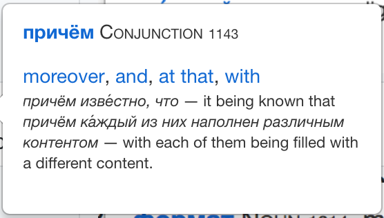
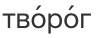

| Example word |                         Example                | Feature |
| ---         |     ---      |          --- |
| зачем |  | Marks accent position in the original word. When cursor is moved over the word, pops up a definition including word base form (here *заче́м*), class (here *Adverb*), frequency rank (here *1624*, meaning it is the 1624th most commonly used word) and a definition. Click on the word base form to navigate to the Wiktionary entry. The frequency rank is useful for language learners, who should focus on learning first the most common 1000 words, then the most common 5000 etc. |
| свет |  | Removes Latin transcription of Russian text from Wiktionary entries. |
| причем, четырехсот |  | Restores *ё* letter in original word when spelled *е*. |
| форматы |  | For nouns, indicates the gender (here *m*=male) and kind (here *inan*=inanimate). In the popup, indicates the declension(s) matched by the original word (here *genitive singular* and *nominative plural*). |
| сумела |  | For verbs, indicates the aspect (here *pf*=perfective) and gives the paired verb (here *уме́ть*). In the popup, indicates the conjugation(s) matched by the original word (here *feminine (я/ты/она́) singular*). |
| продано, расчлененные |  | Recognizes declined forms of verb participles. |
| проще, попроще |  | Recognizes comparative forms. |
| крупнейший, крупнейшего |  | Recognizes superlative forms. |
| творог, свекла |  | Marks all accents where several accent positions are accepted. The reader must stress only one of the positions. |
| лиса |  | Marks all accents where several accent positions are possible depending on grammar. The reader must stress the correct position based on grammar. |
| Тарзан |  | When a word is missing from English Wiktionary, displays entry from Russian Wiktionary instead. The order of language preferences is configurable in the extension options. |
