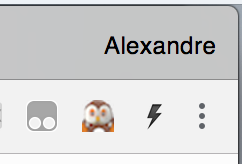

# About

This Chrome extension adds an accent to mark the stress on words in Russian. Hovering over a words brings up a popover with its definition(s) from wiktionary.

The extension contains an index of all Russian words from the English wiktionary site with all their grammatical forms and accent position.

# How to use

After the extension is installed, click on this icon in the Chrome toolbar:

Toggle the switch to enable the extension for the current tab.

# Details

See the [examples](examples.md) page for more information.

### Reporting Issues and Feedback
If you encounter any bugs, please file an issue in the [Issues](https://github.com/algattik/SlavaTranslator/issues) section of our GitHub repo.

# More information

Source code and license information can be found at https://github.com/algattik/SlavaTranslator/.

